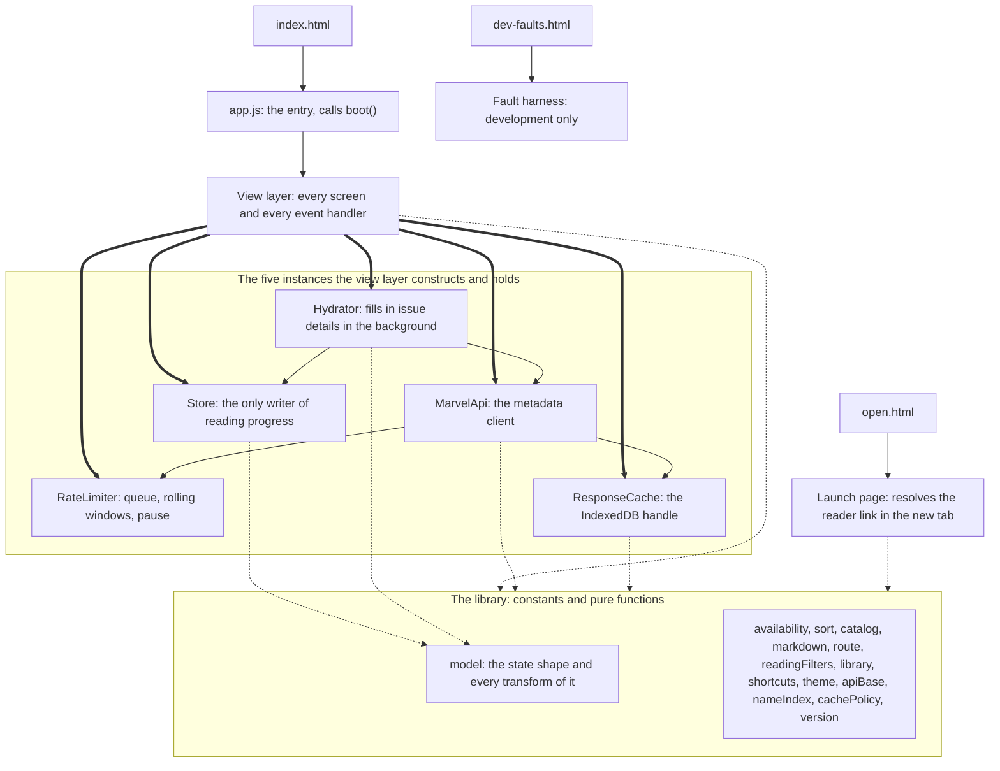
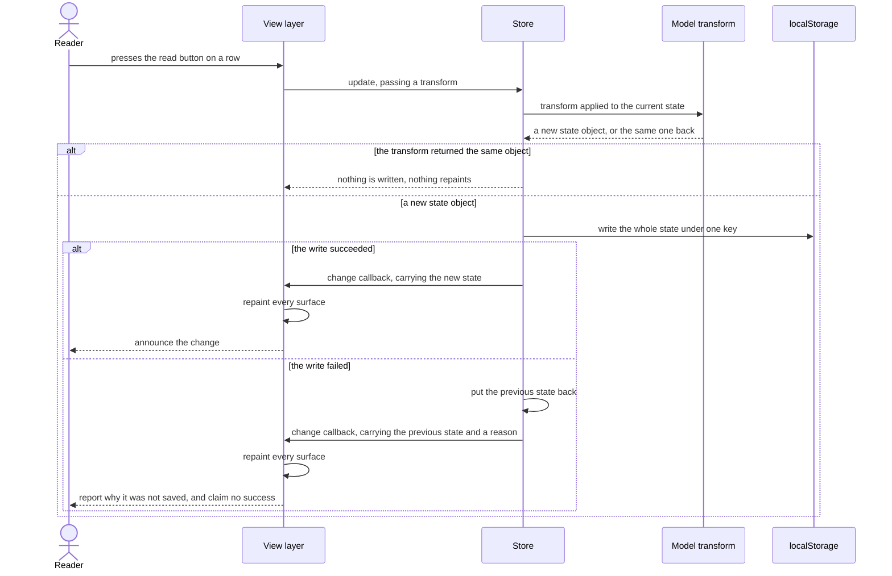

# How the app is put together

This document draws the shape the code already has: which parts own which, what happens between a
click and the screen changing, and where a reader's progress actually lives. It exists because the
repository explains a great deal in words and draws none of it, so anyone describing the app to
another person has had to read the source first.

It is a description, not a proposal. Nothing here argues for moving code, and no diagram should be
read as a target shape. Where the drawing shows something awkward, it is because the code is that
shape today.

The diagrams are Mermaid in fenced code blocks, which GitHub renders where the file is read. That
adds nothing to `package.json`, needs no build step, and keeps the pictures in the same review as
the prose rather than in a binary nobody can diff.

## The three entry points

The app is served from one origin and has three pages, each loading exactly one module. The tracker
itself is loaded at `src/index.html:989`. The launch page, which is the tab a reader's issue opens
into, is loaded at `src/open.html:19`. A fault-injection harness that exists for development and is
no part of the running app is loaded at `src/dev-faults.html:129`.

The module the tracker page loads is not the view layer itself but a small entry whose whole body is
a call to `boot()` and then a registration of the offline worker, at `src/js/app.js:12-24`. The
indirection is the seam that makes the view
layer testable: loading it used to be the same act as starting the application, so a test could not
reach a render function without booting an app that then never exited. The entry has to be a module
rather than an inline script because the server sends `script-src 'self'`, which an inline script
would need a nonce to satisfy.

Nothing bundles or transpiles. The browser loads ES modules directly from `src/`, which is why the
import graph below is also the load graph.

## The module graph, drawn as ownership

Imports say what a file mentions. Ownership says who made the thing and who can change it, which
is the question a reader of this app actually has, because almost every module here is a bag of
pure functions and the interesting state sits in five objects that one file constructs.

Those five are built together at `src/js/main.js:83-98`. Read that block and you have read the
application's wiring.

A thick arrow means constructs and holds. A thin arrow means holds a reference to something
another part constructed. A dotted arrow means calls, and owns nothing.

Four things the picture is making a point of.

**The view layer owns the state, and the library owns none of it.** Twenty-three modules sit under
`src/js/lib/`, and none of them keeps anything at module scope that changes: what is there is
constants and lookup tables, read and never written. Where state exists it belongs to an instance
the view layer made, as the rate limiter's queue and its two rolling windows of recent hits do, set
up at `src/js/lib/limiter.js:11-20`, so two limiters would be two independent budgets. This is why
the graph is worth drawing as ownership. An import arrow from the view layer to the rate limiter
would suggest a dependency on a service. What is actually there is a dependency on an object the
view layer itself created and can throw away.

**Two of the five are replaceable at runtime, and they are replaced together.** Saving a new API
base builds a fresh cache and a fresh client and hands the new client to the hydrator, at
`src/js/main.js:4822-4824`. The hydrator itself is not rebuilt; only its reference to the client is
swapped. The rate limiter is deliberately not rebuilt either, because the budget it tracks belongs
to the reader's connection rather than to whichever base URL is configured. The store is never
replaced at all.

**The client can build its own limiter and cache, and in this app never does.** `MarvelApi` falls
back to constructing both when it is handed neither, at `src/js/api.js:68-69`. That fallback is for
tests and for any future caller; the running app always passes its own, which is what keeps one
budget across every request the page makes.

**One of the twenty-three library modules is not in this graph at all.** `src/js/lib/curated.js` parses
the curated-list manifest, and its only importer outside the tests is the vendoring script, at
`scripts/vendor-orders.mjs:28`. It runs in Node when someone adds a reading list, never in the
browser. So twenty-two of the twenty-three are reachable from the page, and a graph drawn from the
directory listing rather than from the imports would have been wrong by one.

## Marking one issue read

This is the loop that makes the app feel like an app, and it is worth following exactly once,
because every ordinary change a reader makes takes the same path. A list rename, an import, a
reordering and a background metadata fill all go through the same call.

The parts of that worth saying in words.

**The transform is pure and the store is the only writer.** The button's handler at
`src/js/main.js:2760-2774` hands the store a function; the function itself, at
`src/js/lib/model.js:653-655`, returns a new state and touches nothing. Everything that decides
whether a write happened, whether it stuck, and what the screen shows next lives in one method,
`src/js/storage.js:365-392`.

**The repaint is synchronous, and it is inside the write.** By the time `update` returns, the
change callback has already run and the screen already shows the result. That is why the
announcement can be gated on the outcome: `src/js/main.js:343-345` speaks only if the write
actually stuck, so a screen reader never hears "marked read" for a row that has already reverted.

**A failed write repaints too.** The rollback path calls the same callback with the previous state,
so the row goes back to how it was and the reason appears in a notice. A change that was not saved
must never be left on screen looking saved.

**Repainting everything does not mean rebuilding everything.** The callback repaints all seven
surfaces, the six screens plus the blocked banner, at `src/js/main.js:5149-5169`, but the reading
order compares each row against a cache key built from the whole item and reuses the node when
nothing about it changed, and the full order
is skipped entirely while its container is closed. Focus is captured before a rebuild and restored
by identity afterwards, at `src/js/main.js:2659`, which is what keeps the keyboard where the reader
left it. The row list is committed by moving nodes rather than replacing the container, at
`src/js/main.js:2547-2555`.

**Background work uses the same door.** Hydration writes each fetched issue through the same
`update` call, at `src/js/hydrate.js:59`, so a metadata fill arriving while the reader is reading
repaints through exactly the path drawn above. No ordinary change reaches the state except through
`update`, but it is not the only thing that can set the state, and a guard added inside it would
not cover the rest. Boot reads the state in, at `src/js/storage.js:78-110`. Restoring a backup and
starting fresh each replace the whole state rather than transforming it, and both appear in the
next section. Restoring is the one that writes the key directly, at `src/js/storage.js:505-571`,
which also puts it past the latch a failed read sets; the comment above the step that adopts a
restored state, at `src/js/storage.js:634-642`, says that is deliberate, because a restore is a
chosen overwrite.

## Where a reader's data lives

This is the question the product promise turns on, and the answer is more than one key. The store
declares four at `src/js/storage.js:9-12`, the view layer writes two more of its own at
`src/js/main.js:52-53`, and the response cache is not in `localStorage` at all.

Two of the extra keys belong to restoring a backup, which is a path where nothing has gone wrong.
One belongs to a failed read, which is a path where something has. Collapsing those into a single
recovery story would hide the distinction the code is built on, so they are drawn apart.

```mermaid
flowchart TD
  subgraph ordinary["Ordinary saving"]
    change["any change the reader makes"] --> live["mrt.state.v2"]
    prefs["cover art, theme, API base, chosen filter"] --> settings["mrt.settings"]
    rail["collapsing the sidebar"] --> sidebar["sidebar.collapsed"]
    meta["metadata fetched from the API"] --> idb["IndexedDB database mrt-cache, store responses"]
  end

  subgraph bootpath["Boot, and the one path where something has gone wrong"]
    boot["read mrt.state.v2"] --> readable{"readable?"}
    readable -->|"yes"| running["app runs, saving allowed"]
    readable -->|"no"| aside["the unreadable bytes must be kept safe"]
    aside --> slot{"does a salvage copy already hold these exact bytes?"}
    slot -->|"yes"| adopt["adopt the copy already on disk; write nothing"]
    slot -->|"no, and the plain slot is free"| s1["mrt.state.salvage"]
    slot -->|"no, an older incident is in it"| s2["mrt.state.salvage.TIMESTAMP"]
    adopt --> paused["saving paused; the banner offers a download and a fresh start"]
    s1 --> paused
    s2 --> paused
  end

  subgraph restorepath["Restoring a backup, where nothing has gone wrong"]
    file["a backup file the reader chose"] --> valid{"valid?"}
    valid -->|"no"| refused["nothing is written at all"]
    valid -->|"yes"| staged["mrt.state.restore.tmp"]
    staged --> snapshot["mrt.state.prerestore"]
    snapshot --> swapped["mrt.state.v2 replaced"]
    swapped --> cleared["mrt.state.restore.tmp removed"]
    cleared --> undo["Undo restore feeds mrt.state.prerestore back through the same path"]
  end
```

Every name the app writes, and why it exists:

| Key | Written by | Cleared by | Why it exists |
|---|---|---|---|
| `mrt.state.v2` | every saved change, at `src/js/storage.js:448` | erasing everything, which writes an empty state rather than removing the key | The lists, the reading progress, the notes and the availability overrides. This is the reader's data. |
| `mrt.state.restore.tmp` | a restore, before anything is swapped, at `src/js/storage.js:545-550` | the same restore, on the line after the swap, and again if the write throws; any later restore, which overwrites it and then removes it; and the reader's erase | Staging, so the swap cannot half happen. It exists only for the moment between validating a backup and installing it. A removal that itself throws leaves the key behind holding a whole tracker, which nothing reads and nothing offers, so it sits there until the next restore or an erase clears it. Erasing discards it because that dialog says this browser has nothing left, and it is the only route that clears one without a restore. |
| `mrt.state.prerestore` | the same restore, one line later | the reader's erase, and `rewindSnapshot()` at `src/js/storage.js:663-680`, in two of its four routes | The snapshot that makes a restore undoable, read back by `src/js/storage.js:682-699`. It outlives a reload, and `startFresh()` deliberately leaves it, because the undo it leaves standing still hands the reader's lists back. A restore that succeeds replaces it. A restore that fails takes one of four routes. It puts back an earlier snapshot it read, so the undo that earlier restore earned survives. It empties the slot when there was no earlier snapshot to put back. It empties the slot when the browser refuses to put one back, rather than leave an offer to swap in what is already on screen. And when the slot could not be read at all it is left alone, still holding the copy this restore minted a moment earlier, which `undoRestore()` then declines because it matches the saved data. Erasing everything is the only route that removes a snapshot still worth having, because only that dialog promises the data behind it is gone. |
| `mrt.state.salvage` | a failed read, and only when the slot is empty or already holds the same bytes | the reader, from Backup and settings | A copy of data that could not be read, kept because saving is paused and the original must not be overwritten. |
| `mrt.state.salvage.TIMESTAMP` | a failed read when the slot already holds a different incident, at `src/js/storage.js:168-174` | the reader, from Backup and settings | So a second corruption months later cannot clobber the copy taken for the first one. A `.N` is appended when that name is taken too, which one boot can reach on its own, because starting fresh salvages before it clears. |
| `mrt.settings` | the settings form, the cover art switch, the theme control and the reading filter, at `src/js/main.js:695` | nothing | Preferences, not data. Deliberately outside the state so a settings write can never fail a progress write. |
| `sidebar.collapsed` | the sidebar toggle, at `src/js/main.js:1035` | nothing | Whether the rail is collapsed. Wrapped in its own try, because losing it is not worth an error. |

Seven names in all: six fixed, and one family whose suffix is the moment it was written. Two of the
seven belong to the view layer rather than to the store, which is why an enumeration taken from the
storage module alone would have found four.

The two salvage rows are the only ones whose Cleared by column names a person choosing that copy in
particular. Nothing in the app removes a salvage copy on its own, because no rule it could apply would
know whether the reader still wants data the app itself could not read, so they are listed on the
Backup and settings screen and removed one at a time by the reader. The copy belonging to an incident
that is currently blocking saving is listed but not offered, because the banner is at that moment
telling the reader to download it or start fresh and both need it; that offer returns once the block
is resolved.

The erase names itself in three rows, and that is a different kind of naming. It clears those keys
wholesale rather than choosing between them, and only because its own dialog says everything this
browser holds for the tracker is gone. **It does not reach the salvage copies.** Measuring that needs
a run where the erase actually lands, because a blocked store refuses the write and nothing behind
that guard runs, so a copy would survive either way and the reading would prove nothing: after
starting fresh to clear the block and then erasing, `salvageCopies()` answers 1 both before and
after, and `salvagedRaw()` still returns the bytes that could not be read. Whether that is right is
filed as `BL-113` rather than settled here, because the copies are listed on the same screen as the
erase button, each with its own remove control, and so survive in plain sight, which is a different
thing from the undo snapshot that survived behind a button claiming it had gone.

Which copy that is gets asked of storage rather than of the tab doing the asking, at
`src/js/storage.js:291-314`: a copy is protected when it holds exactly what the main slot holds. The
flags recording that this tab is blocked belong to one `Store` instance, and a second tab open since
before the data went bad has none of them set, so deriving it from them left that tab offering to
remove the copy the first tab was relying on. The arrows into the main slot are what makes that
serious: an unblocked tab keeps writing, so it would have overwritten the original moments after
removing the only other record of it.

Three things around the edges of that table.

**The response cache is somewhere else on purpose.** Cached metadata lives in IndexedDB, in a
database named at `src/js/cache.js:9-11`, so it cannot compete for quota with the reader's
progress. That separation is the reason the app is pinned to one origin: the comment at
`src/js/cache.js:3-5` records that IndexedDB is restricted on `file://` origins and that
`file://`, `localhost` and `127.0.0.1` are three separate storage buckets, and the server binds one
of them at `server.mjs:14-16`.

**The launch page writes nothing.** It reads the configured API base out of `mrt.settings` at
`src/open.js:63` and refuses anything it is not allowed to call. Nothing about the reader's
progress is touched in that tab.

**The fault harness writes keys of its own, and is not the app.** `src/dev-faults.js:5-6` declares
its own backup and quota-filling names. They are listed here so a reader looking at their own
storage can tell them apart, not because the tracker ever writes them.

### One thing the drawing found

Drawing the salvage path surfaced a defect that reading it did not. When a second incident is
salvaged, the copy goes under a dated name because the plain slot still holds the first incident's
bytes. That decision was remade from scratch on every boot, and the date is taken at the time of the
write, so reloading the page while still blocked wrote another dated copy of the same bytes. Three
boots attempted three writes, measured against the module as it then stood. Under a fake storage
only two keys survive, since all three land in one millisecond and collide on the same dated name;
three distinct copies is what the browser leaves, where the boots are milliseconds apart.

It cost nothing on a first incident. There is a test for a second, unrelated incident, at
`test/storage.test.js:169-195`, so the dated key itself was covered; what no test did was load twice
inside one incident, which is why the repeat was untested rather than tolerated. It cost a copy of
the reader's whole state per reload on a second one, in exactly the near-quota situation the
salvage code was written to survive.

It was filed as BL-076 and fixed there rather than here, because this document changes no code. A
salvage slot already holding these exact bytes is now adopted rather than written again, at
`src/js/storage.js:137-147`, so the drawing above shows a branch that did not exist when it was first
drawn. Implementing it found two things this section had understated. The repeat was not only per
reload, because `startFresh()` salvages before it clears, so the button the banner points at wrote
one more inside a single boot. And the cost was not only space: near the quota the duplicates
consumed the room the next copy needed, so a later boot reported that nothing had been set aside
while the previous boot's copy sat on disk, and the escape hatch refused on that false report.

Pressing the fix turned up a third, worse fault that reading had also missed. Because
`startFresh()` salvages inside the same boot, two archived copies could take the same timestamped
name and the second overwrote the first, destroying a copy the reader had already been promised.
The archived name is now checked to be free before it is used. The lesson is the one this section
was drawn to make: the fault was found by attacking a claim, not by re-reading the code that made
it.

## What a per-view split does to these diagrams

BL-042 proposes breaking the 5,244 line view file into per-view modules. A diagram drawn at the
level of function names inside that file would be falsified the day it lands, so each of the three
above was pitched to survive it. Two do. One survives in shape but has a detail that will need
rewriting, and it is more useful to say which than to claim all three are safe.

**The module graph survives.** Its nodes are responsibilities and owned instances, and the only
node the split touches is the view layer, which becomes several files that between them do what one
file does now. What the layer owns does not change, and BL-042's own second task is to keep the
store wiring in one place, so the single arrow from the view layer to the store is something that
item is committed to preserving rather than something this drawing assumes.

**The persistence diagram survives.** Every key keeps its name and its writer keeps its reason. Two
of the seven are written by the view layer, so the split moves the line of code that writes them
without changing what is written or when. The one citation in the table that would need re-aiming
is the one that names a line in the view file, which is a citation problem rather than a drawing
problem.

**The reading action survives in shape, with one claim that will not.** The sequence names the
store's contract and the surfaces that repaint, not the functions that repaint them, so "one
function fans out to seven" becoming "one module fans out to seven" changes nothing drawn. What is
genuinely at risk is the claim that the repaint is synchronous inside the write, and the
announcement gate that depends on it. That is a property of a call made directly from the store's
change callback, and a split that put a scheduler or a batch in between would falsify it. If BL-042
lands and the repaint stops being synchronous, this section is wrong and needs rewriting rather
than re-aiming. It is written down here so that whoever lands the split knows the diagram is
watching for it.

## Where to read next

[Why this is a browser app and not an Android emulator](WHY_A_BROWSER_APP.md) records why the app
sits beside Marvel Unlimited rather than replacing it. [The UX study](UX_STUDY.md) covers the
interface rather than the structure, and the four documents under `docs/ux` specify individual
flows.
