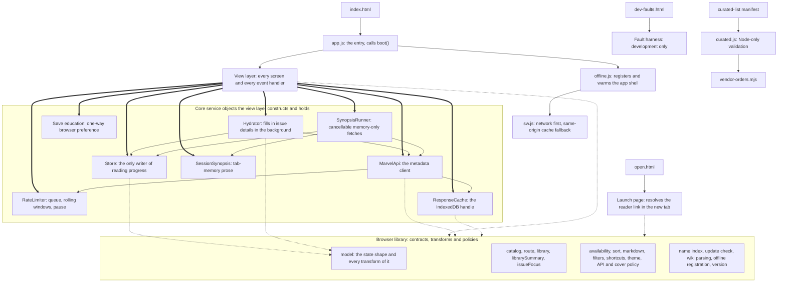
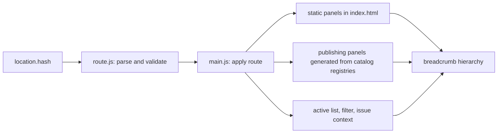
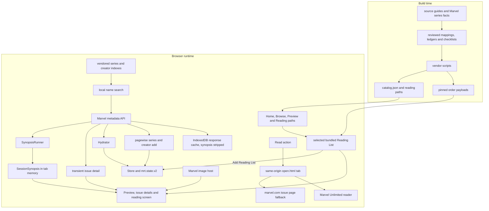
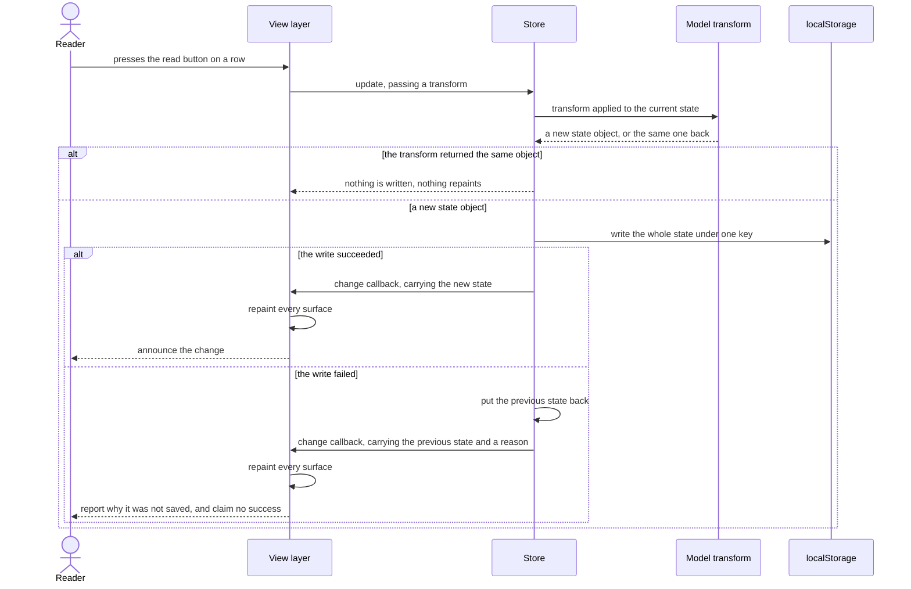
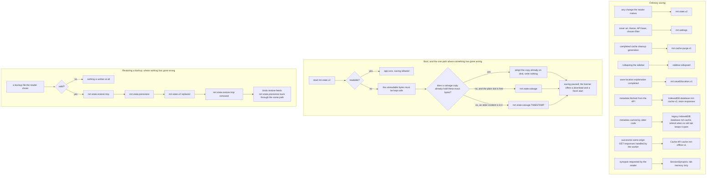

# How the app is put together

This document draws the shape the code already has: which parts own which, what happens between a
click and the screen changing, and where a reader's progress actually lives. It exists because the
repository explains a great deal in words and draws none of it, so anyone describing the app to
another person has had to read the source first.

It is a description, not a proposal. Nothing here argues for moving code, and no diagram should be
read as a target shape. Where the drawing shows something awkward, it is because the code is that
shape today.

The diagrams are Mermaid in fenced code blocks, which GitHub renders where the file is read. That
adds nothing to `package.json`, needs no build step, and keeps the pictures in the same review as
the prose rather than in a binary nobody can diff.

## The three entry points

The app is served from one origin and has three pages, each loading exactly one module. The tracker
itself is loaded at `src/index.html:1061`. The launch page, which is the tab a reader's issue opens
into, is loaded at `src/open.html:19`. A fault-injection harness that exists for development and is
no part of the running app is loaded at `src/dev-faults.html:135`.

The module the tracker page loads is not the view layer itself but a small entry whose whole body is
a call to `boot()` and then a registration of the offline worker, at `src/js/app.js:12-24`. The
indirection is the seam that makes the view
layer testable: loading it used to be the same act as starting the application, so a test could not
reach a render function without booting an app that then never exited. The entry has to be a module
rather than an inline script because the server sends `script-src 'self'`, which an inline script
would need a nonce to satisfy.

Nothing bundles or transpiles. The browser loads ES modules directly from `src/`, which is why the
import graph below is also the load graph.

## The module graph, drawn as ownership

Imports say what a file mentions. Ownership says who made the thing and who can change it, which
is the question a reader of this app actually has. Most modules expose stateless functions and
contracts. The controller constructs its core service objects together at
`src/js/main.js:87-107`; application-wide bookkeeping lives at module scope, while constructed view
modules own state that is local to one screen. Read that block for the application's service wiring,
not as an exhaustive inventory of every value kept in memory.

A thick arrow means constructs and holds. A thin arrow means holds a reference to something
another part constructed. A dotted arrow means calls, and owns nothing.

Four things the picture is making a point of.

**The view layer owns the state, and the library owns no mutable singleton service.** Where state
exists it belongs to an instance the view layer made, as the rate limiter's queue and its two
rolling windows of recent hits do, set up at `src/js/lib/limiter.js:11-20`, so two limiters would be
two independent budgets. The same is true of the save-education preference and session synopsis
map. This is why the graph is worth drawing as ownership. An import arrow from the view layer to the
rate limiter would suggest a dependency on a service. What is actually there is a dependency on an
object the view layer itself created and can throw away.

**The API client and its response cache are replaceable at runtime.** Saving a new API base builds
a fresh pair and hands the replacement client to both the Hydrator and SynopsisRunner, at
`src/js/main.js:3399-3409`. An in-flight synopsis run is cancelled and its tab-memory prose is
cleared rather than carried across services. The rate limiter is deliberately not rebuilt, because
the budget it tracks belongs to the reader's connection rather than to whichever base URL is
configured. The Store is not replaced.

**The client can build its own limiter and cache, and in this app never does.** `MarvelApi` falls
back to constructing both when it is handed neither, at `src/js/api.js:68-69`. That fallback is for
tests and for any future caller; the running app always passes its own, which is what keeps one
budget across every request the page makes.

**Synopsis state is intentionally separate from saved metadata.** `SessionSynopsis` is a tab-memory
map and `SynopsisRunner` is a cancellable fetch owner. Neither writes through the Store or the
response cache. The three independent refusal points are recorded at `src/js/synopsis.js:8-15`:
normalization drops prose, API cache writes strip it, and the request uses `no-store`.

**One library module belongs only to the build-time graph.** `src/js/lib/curated.js` parses the
curated-list manifest for the vendoring script at `scripts/vendor-orders.mjs:31` and the Comic Book
Herald packet-authoring script at `scripts/author-cbh-packet.mjs:6`. Both run in Node, never in the
browser. The same Node-only boundary contains `scripts/lib/chapter-orders.mjs`: one noncatalog
source order can be validated and emitted as ordinary child payloads, catalog entries, a reading
path and overlap evidence without teaching the browser a partition model. Every other module under
`src/js/lib/` is reachable from the browser graph.

## Routes and generated views

The address after `#/` is application state, not decoration. The parser accepts only names in the
route registry at `src/js/lib/route.js:12-27`. Publishing and custom Home-category routes are
derived from the same definitions that generate those screens. Static panels and their navigation
buttons remain separate markup, so adding one requires keeping that markup and the registry in
step; route tests hold the shipped set together.

Most panels exist in `index.html`. Publication-age leaves are the exception: `boot()` calls
`ensurePublishingViews()` before wiring navigation, so every configured publishing route gets a
panel from the same registry that made it routable. Issue addresses may also carry validated list
or bundled-order context, which lets Back and the breadcrumb return to the surface that opened the
details without guessing at browser history.

The hash is load-bearing. A path route would ask the static server for a file it does not have, and
a different origin would select a different browser storage bucket. The reasons are kept beside the
parser at `src/js/lib/route.js:1-6`.

## How reading content reaches the browser

Curated content and live metadata take different routes. They can meet transiently on Preview,
issue details, and issue-focus results, but they enter saved reader data only through the Store.
The catalog is built before release and carries the exact source and gap decisions already
reviewed; browsing it does not need the metadata service. With the loopback server stopped, only
same-origin resources the service worker has already cached are available, so an unvisited payload
is not guaranteed offline. Live metadata is optional enrichment. Synopsis prose is a third route
because it is shown without being kept.

On a targeted run, the vendor reuses pinned payloads for skipped orders before deriving the complete
catalog. It then atomically writes the output batch assembled by that invocation, including
`catalog.json` and any generated overlap artifacts, at `scripts/vendor-orders.mjs:587-635`. At
runtime the catalog is fetched once from the same origin and parsed at
`src/js/main.js:3154-3164`, so browsing does not depend on the metadata service.

Series and creator names are searched in vendored indexes. Selecting one then pages its issues from
the API. API responses use `no-store`, and cache writes remove synopsis prose before IndexedDB sees
them, at `src/js/api.js:81-120`. Hydration sends normalized factual metadata through the same Store
boundary as a reader edit; synopsis requests instead end in the tab-memory map and disappear when
the tab closes.

A Read press opens the same-origin launch page synchronously so popup permission is not lost,
at `src/js/reader.js:57-90`. A known digital ID redirects straight to Marvel Unlimited. Otherwise
the launch page asks the configured metadata service once and falls back to the official issue page
when no reader link can be resolved, at `src/open.js:72-100`. The launch page never reads or writes
reading progress.

## Marking one issue read

This is the loop that makes the app feel like an app, and it is worth following exactly once,
because every ordinary change a reader makes takes the same path. A list rename, an import, a
reordering and a background metadata fill all go through the same call.

The parts of that worth saying in words.

**The transform is pure and the store is the only writer.** The button's handler at
`src/js/main.js:2718-2732` hands the store a function; the function itself, at
`src/js/lib/model.js:653-655`, returns a new state and touches nothing. Everything that decides
whether a write happened, whether it stuck, and what the screen shows next lives in one method,
`src/js/storage.js:372-399`.

**The repaint is synchronous, and it is inside the write.** By the time `update` returns, the
change callback has already run and the screen already shows the result. That is why the
announcement can be gated on the outcome: `src/js/main.js:301-303` speaks only if the write
actually stuck, so a screen reader never hears "marked read" for a row that has already reverted.

**A failed write repaints too.** The rollback path calls the same callback with the previous state,
so the row goes back to how it was and the reason appears in a notice. A change that was not saved
must never be left on screen looking saved.

**Refreshing shared state does not mean rebuilding every view.** The callback runs the shared
refresh fan-out at `src/js/main.js:3642-3661`, including the rail, reading view, Home, Library hub
and detail, Progress, API queue, Add destination, blocked state, breadcrumbs and route
synchronization. Catalog and generated publishing panels render when their routes need them. Inside
the reading view, each row is compared against a cache key built from the whole item and its node is
reused when nothing changed, while the full order is skipped entirely when its container is closed.
Focus is captured before a rebuild and restored by identity afterwards, at
`src/js/main.js:2613`, which is what keeps the keyboard where the reader left it. The row list is
committed by moving nodes rather than replacing the container, at
`src/js/main.js:2501-2509`.

**Background work uses the same door.** Hydration writes each fetched issue through the same
`update` call, at `src/js/hydrate.js:59`, so a metadata fill arriving while the reader is reading
repaints through exactly the path drawn above. No ordinary change reaches the state except through
`update`, but it is not the only thing that can set the state, and a guard added inside it would
not cover the rest. Boot reads the state in, at `src/js/storage.js:85-117`. Restoring a backup and
starting fresh each replace the whole state rather than transforming it, and both appear in the
next section. Restoring is the one that writes the key directly, at `src/js/storage.js:518-584`,
which also puts it past the latch a failed read sets; the comment above the step that adopts a
restored state, at `src/js/storage.js:647-655`, says that is deliberate, because a restore is a
chosen overwrite.

**Long series and creator adds are pagewise transactions.** The API delivers each normalized page
before it requests the next one, while still returning the complete array to callers that need it,
at `src/js/api.js:193-230`. The view gives each form its own run owner, at
`src/js/views/add.js:63-162`. The first nonempty page creates and fills its list inside one Store
update, and every later completed page uses the same boundary, at `src/js/views/add.js:22-61` and
`src/js/views/add.js:164-190`. Cancelling retires that owner before aborting its request, so a response
that arrives late cannot write into a replacement run. The active notice carries the Cancel action;
when that action disappears while focused, the matching search field receives focus, at
`src/js/views/add.js:287-319`. A stop before the first page creates no list, while every page already
saved remains available after a reload.

## Where a reader's data lives

This is the question the product promise turns on, and the answer is more than one key. The Store
declares four names at `src/js/storage.js:11-14`, the controller owns settings, cache-cleanup and
sidebar preferences at `src/js/main.js:64-66`, and save education owns one more at
`src/js/lib/saveEducation.js:1`. Metadata responses live in IndexedDB, the offline app shell lives
in the Cache API, and synopsis prose lives only in memory.

Two of the extra keys belong to restoring a backup, which is a path where nothing has gone wrong.
One belongs to a failed read, which is a path where something has. Collapsing those into a single
recovery story would hide the distinction the code is built on, so they are drawn apart.

Every `localStorage` name the tracker writes, and why it exists:

| Key | Written by | Cleared by | Why it exists |
|---|---|---|---|
| `mrt.state.v2` | every saved change, at `src/js/storage.js:461` | erasing everything, which writes an empty state rather than removing the key | The lists, the reading progress, the notes and the availability overrides. This is the reader's data. |
| `mrt.state.restore.tmp` | a restore, before anything is swapped, at `src/js/storage.js:558-563` | the same restore, on the line after the swap, and again if the write throws; any later restore, which overwrites it and then removes it; and the reader's erase | Staging, so the swap cannot half happen. It exists only for the moment between validating a backup and installing it. A removal that itself throws leaves the key behind holding a whole tracker, which nothing reads and nothing offers, so it sits there until the next restore or an erase clears it. Erasing discards it because that dialog says this browser has nothing left, and it is the only route that clears one without a restore. |
| `mrt.state.prerestore` | the same restore, one line later | the reader's erase, and `rewindSnapshot()` at `src/js/storage.js:676-693`, in two of its four routes | The snapshot that makes a restore undoable, read back by `src/js/storage.js:695-712`. It outlives a reload, and `startFresh()` deliberately leaves it, because the undo it leaves standing still hands the reader's lists back. A restore that succeeds replaces it. A restore that fails takes one of four routes. It puts back an earlier snapshot it read, so the undo that earlier restore earned survives. It empties the slot when there was no earlier snapshot to put back. It empties the slot when the browser refuses to put one back, rather than leave an offer to swap in what is already on screen. And when the slot could not be read at all it is left alone, still holding the copy this restore minted a moment earlier, which `undoRestore()` then declines because it matches the saved data. Erasing everything is the only route that removes a snapshot still worth having, because only that dialog promises the data behind it is gone. |
| `mrt.state.salvage` | a failed read, and only when the slot is empty or already holds the same bytes | the reader, from Backup and settings | A copy of data that could not be read, kept because saving is paused and the original must not be overwritten. |
| `mrt.state.salvage.TIMESTAMP` | a failed read when the slot already holds a different incident, at `src/js/storage.js:175-181` | the reader, from Backup and settings | So a second corruption months later cannot clobber the copy taken for the first one. A `.N` is appended when that name is taken too, which one boot can reach on its own, because starting fresh salvages before it clears. |
| `mrt.settings` | the settings form, the cover art switch, the theme control and the reading filter, at `src/js/main.js:675-683` | nothing | Preferences, not data. Deliberately outside the state so a settings write can never fail a progress write. An older `cachePurge` field is read once as migration input but is no longer authoritative or written by current code. |
| `mrt.cache-purge.v1` | successful cache cleanup, at `src/js/main.js:635-653` | nothing | A monotonic cleanup generation held apart from settings so an older tab cannot lower it by serializing the settings shape it knows. Current tabs serialize its read-max-write step through one origin-wide browser lock. |
| `sidebar.collapsed` | the sidebar toggle, at `src/js/main.js:1211` | nothing | Whether the rail is collapsed. Wrapped in its own try, because losing it is not worth an error. |
| `mrt.saveEducation.v1` | the first nonempty saved list and first confirmed progress change, through `src/js/lib/saveEducation.js:25-74` | nothing | A one-way preference recording whether the reading screen still needs to explain where progress is saved. It is separate from reader data, reconciles across tabs, and a failed preference write never turns a successful progress write into a failure. |

Nine rows in all: eight fixed names, and one family whose suffix is the moment it was written. Four
belong outside the Store, which is why an enumeration taken from the storage module alone finds only
the reader-data and recovery names.

The two salvage rows are the only ones whose Cleared by column names a person choosing that copy in
particular. Nothing in the app removes a salvage copy on its own, because no rule it could apply would
know whether the reader still wants data the app itself could not read, so they are listed on the
Backup and settings screen and removed one at a time by the reader. The copy belonging to an incident
that is currently blocking saving is listed but not offered, because the banner is at that moment
telling the reader to download it or start fresh and both need it; that offer returns once the block
is resolved.

The erase names itself in three rows, and that is a different kind of naming. It clears those keys
wholesale rather than choosing between them, and only because its own dialog says everything this
browser holds for the tracker is gone. **It does not reach the salvage copies.** Measuring that needs
a run where the erase actually lands, because a blocked store refuses the write and nothing behind
that guard runs, so a copy would survive either way and the reading would prove nothing: after
starting fresh to clear the block and then erasing, `salvageCopies()` answers 1 both before and
after, and `salvagedRaw()` still returns the bytes that could not be read. Whether that is right is
filed as `BL-113` rather than settled here, because the copies are listed on the same screen as the
erase button, each with its own remove control, and so survive in plain sight, which is a different
thing from the undo snapshot that survived behind a button claiming it had gone.

Which copy that is gets asked of storage rather than of the tab doing the asking, at
`src/js/storage.js:298-321`: a copy is protected when it holds exactly what the main slot holds. The
flags recording that this tab is blocked belong to one `Store` instance, and a second tab open since
before the data went bad has none of them set, so deriving it from them left that tab offering to
remove the copy the first tab was relying on. The arrows into the main slot are what makes that
serious: an unblocked tab keeps writing, so it would have overwritten the original moments after
removing the only other record of it.

Three things around the edges of that table.

**The response cache is somewhere else on purpose.** Current cached metadata lives in IndexedDB
database `mrt-cache-v2`, named at `src/js/cache.js:9-12`, so it cannot compete for quota with the
reader's progress. Older code can keep writing only to the separate legacy `mrt-cache` database.
Current code requests its deletion at startup and during manual clearing, but reports partial cleanup
while an older tab keeps that deletion blocked. That separation is the reason the app is pinned to one origin: the comment at
`src/js/cache.js:3-5` records that IndexedDB is restricted on `file://` origins and that
`file://`, `localhost` and `127.0.0.1` are three separate storage buckets, and the server binds one
of them at `server.mjs:21-23`.

**The offline shell uses a different browser store for a different job.** Cache API cache
`mrt-offline-v1` stores successful 200 responses to same-origin GET requests the worker handles,
including the warmed app shell and later requested bundled payloads. The worker rejects other
origins before opening that cache, at `src/sw.js:58-70`, so Marvel covers and metadata responses
cannot enter it. Network is always tried first, and each successful response replaces its cached
copy; a cached URL is read only when the loopback server cannot answer, at `src/sw.js:73-114`.
There is no in-app control that clears this cache. Activation removes older `mrt-offline-*`
generations but leaves the current one in place, at `src/sw.js:44-55`.

**Synopsis prose is deliberately in no browser store.** `SessionSynopsis` keeps it in a Map that
dies with the tab. The API request uses `no-store`, the response cache strips the field, and saved
state normalization refuses it. The separate boundaries mean clearing metadata, exporting a backup,
and reloading all agree that the prose was temporary.

**The launch page writes nothing.** It reads the configured API base out of `mrt.settings` at
`src/open.js:63` and refuses anything it is not allowed to call. Nothing about the reader's
progress is touched in that tab.

**The fault harness writes keys of its own, and is not the app.** `src/dev-faults.js:5-6` declares
its own backup and quota-filling names. They are listed here so a reader looking at their own
storage can tell them apart, not because the tracker ever writes them.

### One thing the drawing found

Drawing the salvage path surfaced a defect that reading it did not. When a second incident is
salvaged, the copy goes under a dated name because the plain slot still holds the first incident's
bytes. That decision was remade from scratch on every boot, and the date is taken at the time of the
write, so reloading the page while still blocked wrote another dated copy of the same bytes. Three
boots attempted three writes, measured against the module as it then stood. Under a fake storage
only two keys survive, since all three land in one millisecond and collide on the same dated name;
three distinct copies is what the browser leaves, where the boots are milliseconds apart.

It cost nothing on a first incident. There is a test for a second, unrelated incident, at
`test/storage.test.js:169-195`, so the dated key itself was covered; what no test did was load twice
inside one incident, which is why the repeat was untested rather than tolerated. It cost a copy of
the reader's whole state per reload on a second one, in exactly the near-quota situation the
salvage code was written to survive.

It was filed as BL-076 and fixed there rather than here, because this document changes no code. A
salvage slot already holding these exact bytes is now adopted rather than written again, at
`src/js/storage.js:144-154`, so the drawing above shows a branch that did not exist when it was first
drawn. Implementing it found two things this section had understated. The repeat was not only per
reload, because `startFresh()` salvages before it clears, so the button the banner points at wrote
one more inside a single boot. And the cost was not only space: near the quota the duplicates
consumed the room the next copy needed, so a later boot reported that nothing had been set aside
while the previous boot's copy sat on disk, and the escape hatch refused on that false report.

Pressing the fix turned up a third, worse fault that reading had also missed. Because
`startFresh()` salvages inside the same boot, two archived copies could take the same timestamped
name and the second overwrote the first, destroying a copy the reader had already been promised.
The archived name is now checked to be free before it is used. The lesson is the one this section
was drawn to make: the fault was found by attacking a claim, not by re-reading the code that made
it.

## What is intentionally centralized

The application controller still owns route application, shared event orchestration, shared
rendering and the long-lived objects in the first diagram. Constructed view modules own local
painting, interaction wiring and transient view state. That is a description of the current
implementation, not a proposal to preserve one file at any size. Active architecture work belongs
in a repository Issue, where a change can state which contracts it keeps and which it deliberately
replaces.

The stable boundaries in this document are behavioral:

- The Store remains the only ordinary writer of reading progress.
- Routes and panels derive from shared registries rather than duplicate lists.
- Vendoring finishes before release and writes one atomic generated output set.
- Cached factual metadata, the offline shell, temporary synopsis prose and reader data remain in
  separate stores with separate lifetimes.
- A Read press opens its same-origin launch tab before any asynchronous lookup.

A future file split that preserves those contracts changes the ownership diagram's boxes, not the
data flow. A change that introduces scheduling between a Store update and its repaint, moves
synopsis prose into durable storage, or makes a reader lookup precede `window.open` changes the
architecture and must rewrite the relevant section rather than merely re-aim its citations.

## Reading Paths are a catalog projection

Reading Paths add no second content or persistence model. Build-time authoring emits path
descriptions and ordered Reading List ids into `catalog.json`; the browser treats the paths in that
parsed generated catalog as the complete authority. `resolveReadingPaths()` resolves every path
independently against the same catalog stories at `src/js/lib/catalog.js:1410-1462`, including paths
emitted from a partition ledger rather than declared in the ordinary curated manifest, at
`scripts/lib/chapter-orders.mjs:377-387`.

That aggregate model is deliberately separate from shelf orientation. Shelf badges keep the first
path that reaches a story so one row has one stable position, at `src/js/lib/catalog.js:685-703`.
The aggregate resolver keeps each path's own ordinal and neighbours, so a story shared by future
paths remains a separate stop in each sequence.

Home and Browse render the same gateway descriptor from the resolved catalog and both open one
Reading paths view. The controller constructs that view with catalog loading, Store reads, route
intent and history effects rather than giving it those concrete owners, at
`src/js/main.js:4165-4199`. The selected id lives only in the validated `path` query of the hash
route, not in saved reader state, as enforced at `src/js/lib/route.js:160-195`.

The view owns the resolved paths, selected structure, selector identity and async generation. It
rejects stale or hidden continuations, falls back to the first resolved path when the requested id
is absent or invalid, and asks the controller to canonically replace that route at
`src/js/views/reading-paths.js:98-129`. A deliberate selector change instead asks the controller to
push history, at `src/js/views/reading-paths.js:132-138`.

Progress is a projection of the Store onto each stop. The Reading Paths module prefers the imported
list whose catalog id exactly matches the stop, then the first imported sibling in catalog order,
then reports **Not added**, at `src/js/views/reading-paths.js:9-24`. Cross-tab state replacement and
whole-origin clearing call the constructed view's progress-only repaint at
`src/js/main.js:124-144`; that repaint changes only the progress outputs at
`src/js/views/reading-paths.js:48-56`, preserving the selector's DOM identity and keyboard focus.

Catalog shelves, Preview and generated publishing pages share one constructed presentation
contract for cards, path choice, source disclosure and path links. That internal module owns the
choice without importing the controller or another concrete view, while the controller injects
navigation, imports, Store effects and publishing-page orchestration at
`src/js/main.js:4046-4163`.

## Where to read next

[Why this is a browser app and not an Android emulator](WHY_A_BROWSER_APP.md) records why the app
sits beside Marvel Unlimited rather than replacing it. [Data provenance](DATA_PROVENANCE.md)
continues the build-time side of the content flow, and [Maintaining Recap Page](MAINTAINING.md)
owns the procedures that generate and release it.

The [UX study](UX_STUDY.md) and the documents under `docs/ux` are dated design evidence. They explain
decisions made during earlier interface passes, but the current README, running guide and tested
route registries own the behavior a reader should expect now.

## The Windows package is a launch envelope

The x64 and ARM64 MSIX packages add a small JavaScript coordinator around the existing browser
companion. They do not add another application runtime or persistence model. Start launches the
architecture-matched packaged Node executable with `Launcher.mjs`. The coordinator removes every
casing of the two environment values that can change the origin or suppress browser opening, starts
the same Node executable with `server.mjs` as a hidden detached process, and waits for a cache-proof
health response naming the digest of the exact package inputs. It also verifies that the listener is
the current package's Node executable running the current packaged server command. Only then does it
open the external browser. Another activation applies the same checks before reuse. A foreign or
older listener, launch failure, or readiness timeout remains visible with corrective guidance.

Direct manifest activation of Node was measured first. It started the right command and served the
right origin, but its console closed immediately when Node refused an occupied port. Package Support
Framework kept the command wrapper visible, but Microsoft's distributed binaries may send
usage telemetry when Windows diagnostic collection is enabled. An x64 C# launcher proved the
installed behavior, but the Windows inbox compiler cannot emit ARM64. The selected coordinator uses
the official Node runtime already in each package, so both entry processes are native to their slice
without a second runtime or a higher Windows version floor.

The background server normally lasts until the Windows session ends, the package is updated or
removed, or the reader explicitly ends it in Task Manager. Closing the browser does not stop it.
This is intentional: the first Store certification run proved that tying the server to a visible
console can leave the service worker showing a cached shell after the server has died. The shell
cannot safely imply that uncached local data remains available, so its cache-proof health probe also
drives recovery guidance for catalog, Reading List, creator-index, and series-index failures.

Package files remain read-only. Browser state remains under `mrt.state.v2` and the other stores
described above, in the external browser's exact origin and profile. The package never reads or
writes those stores. [The Microsoft Store package guide](MICROSOFT_STORE.md) owns build, proof,
identity, cleanup, and remaining publication gates.
