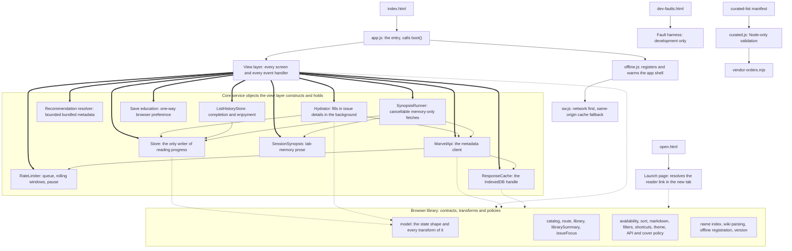
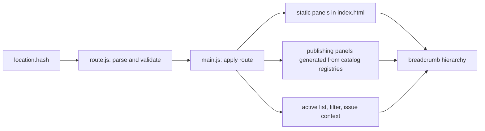
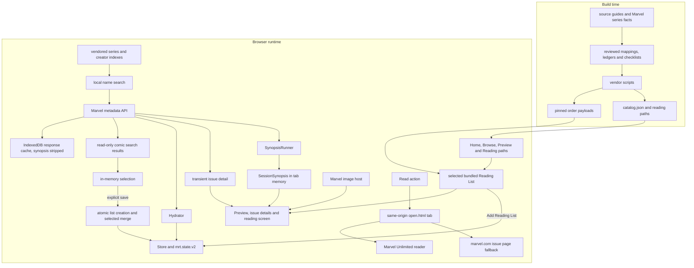
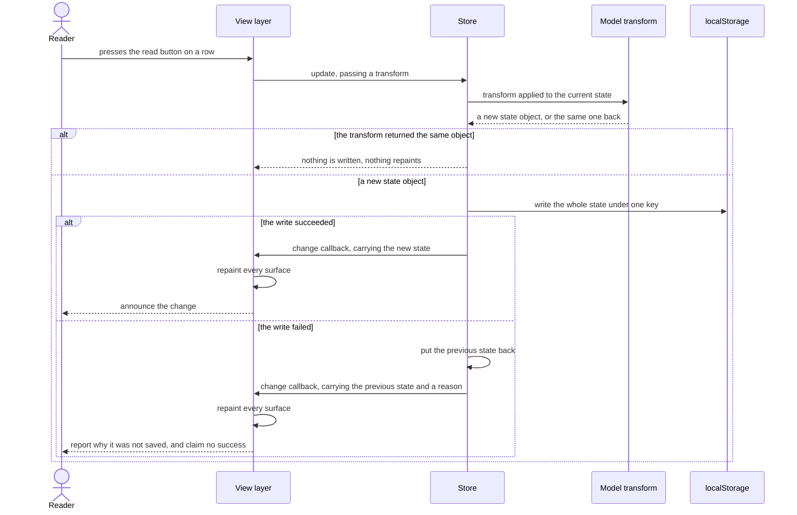
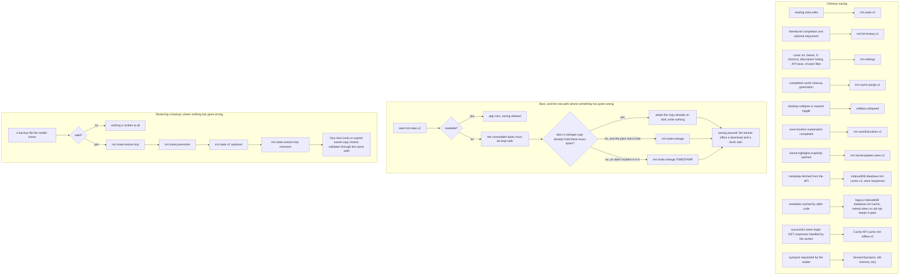
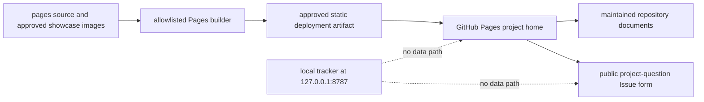

# How the app is put together

How the browser core owns state, updates screens, and saves reading progress. These diagrams describe
the current implementation, not a proposed redesign. See [Android](ANDROID.md) for the native wrapper.

GitHub renders the Mermaid diagrams directly. They need no build step or dependency, and their
source can be reviewed alongside the prose.

## The three entry points

The desktop source has three pages at one origin, each loading one module: the tracker at
`src/index.html:1387`, the reader launch tab at `src/open.html:21`, and the development-only fault
harness at `src/dev-faults.html:137`.

The tracker entry calls `boot()` and registers the offline worker at `src/js/app.js:12-24`.
Separating startup lets tests import view functions without booting the app. The external module
also satisfies `script-src 'self'`; inline startup code would require a content security policy change.

The browser loads ES modules directly from `src/`, without bundling or transpilation.

## The module graph, drawn as ownership

Most modules expose stateless functions and contracts. The controller constructs the core services
at `src/js/main.js:90-132` and keeps application-wide bookkeeping at module scope. Constructed views
own their screen-local state. That block shows service wiring, not every value held in memory.

```mermaid
flowchart TD
  idx["index.html"] --> app["app.js: the entry, calls boot()"]
  app --> view["View layer: every screen and every event handler"]
  app --> offline["offline.js: registers and warms the app shell"]
  offline --> worker["sw.js: network first, same-origin cache fallback"]
  opn["open.html"] --> launch["Launch page: resolves the reader link in the new tab"]
  dev["dev-faults.html"] --> harness["Fault harness: development only"]

  subgraph owned["Core service objects the view layer constructs and holds"]
    store["Store: the only writer of reading progress"]
    history["ListHistoryStore: completion and enjoyment"]
    recommendations["Recommendation resolver: bounded bundled metadata"]
    limiter["RateLimiter: queue, rolling windows, pause"]
    cache["ResponseCache: the IndexedDB handle"]
    api["MarvelApi: the metadata client"]
    hydrator["Hydrator: fills in issue details in the background"]
    education["Save education: one-way browser preference"]
    synopses["SessionSynopsis: tab-memory prose"]
    synopsisRunner["SynopsisRunner: cancellable memory-only fetches"]
  end

  view ==> store
  view ==> history
  view ==> recommendations
  view ==> limiter
  view ==> cache
  view ==> api
  view ==> hydrator
  view ==> education
  view ==> synopses
  view ==> synopsisRunner

  api --> limiter
  api --> cache
  hydrator --> api
  hydrator --> store
  history --> store
  synopsisRunner --> api
  synopsisRunner --> store
  synopsisRunner --> synopses

  subgraph lib["Browser library: contracts, transforms and policies"]
    model["model: the state shape and every transform of it"]
    discovery["catalog, route, library, librarySummary, issueFocus"]
    policy["availability, sort, markdown, filters, shortcuts, theme, API and cover policy"]
    integrations["name index, wiki parsing, offline registration, version"]
  end

  view -.-> lib
  store -.-> model
  hydrator -.-> model
  api -.-> lib
  cache -.-> lib
  launch -.-> lib

  manifest["curated-list manifest"] --> curated["curated.js: Node-only validation"]
  curated --> vendor["vendor-orders.mjs"]
```

A thick arrow means constructs and owns; a thin arrow means holds a reference; a dotted arrow means
calls without ownership.

**The view layer owns state; the library has no mutable singleton service.** Each rate limiter owns
its queue and two rolling windows at `src/js/lib/limiter.js:11-20`, so separate instances have
independent budgets. Save education and session synopsis state are instance-owned too.

**Changing the API base replaces the client and cache.** The replacement goes to the Hydrator and
SynopsisRunner at `src/js/main.js:2319-2334`. In-flight synopsis work is cancelled and its memory
cleared. The Store stays in place, as does the rate limiter: its budget belongs to the reader's
connection, not the configured service.

**The app supplies one limiter and cache.** `MarvelApi` can construct its own at `src/js/api.js:68-69`,
but that fallback is for tests and other callers. The app supplies them to keep one request budget.

**Synopsis state is intentionally separate from saved metadata.** `SessionSynopsis` is a tab-memory
map and `SynopsisRunner` is a cancellable fetch owner. Neither writes through the Store or the
response cache. The three independent refusal points are recorded at `src/js/synopsis.js:8-15`:
normalization drops prose, API cache writes strip it, and the request uses `no-store`.

**Curated authoring is Node-only.** `src/js/lib/curated.js` parses the manifest for
`scripts/vendor-orders.mjs:31` and `scripts/author-cbh-packet.mjs:6`. These never run in the browser.
The Node-only `scripts/lib/chapter-orders.mjs` turns a noncatalog source order into ordinary child
payloads, catalog entries, a reading path, and overlap evidence. The browser needs no partition
model. Every other module under `src/js/lib/` is browser-reachable.

## Routes and generated views

The hash after `#/` holds navigation state. The parser accepts only registered routes at
`src/js/lib/route.js:14-29`. Publishing and custom Home-category routes share definitions with their
generated screens. Static panels and buttons use separate markup; keep that markup and the registry
in sync when adding a panel.

```mermaid
flowchart LR
  hash["location.hash"] --> parser["route.js: parse and validate"]
  parser --> apply["main.js: apply route"]
  apply --> static["static panels in index.html"]
  apply --> generated["publishing panels generated from catalog registries"]
  apply --> state["active list, filter, issue context"]
  static --> crumbs["breadcrumb hierarchy"]
  generated --> crumbs
  state --> crumbs
```

Most panels exist in `index.html`. Publication-age leaves are the exception: `boot()` calls
`ensurePublishingViews()` before wiring navigation, so every configured publishing route gets a
panel from the same registry that made it routable. Issue addresses may also carry validated list
or bundled-order context, which lets Back and the breadcrumb return to the surface that opened the
details without guessing at browser history.

Hash routing keeps the address on the same static file and storage origin. Path routes would request
missing files; changing the origin would select different storage. See `src/js/lib/route.js:1-6`.

Completed lists is a registered Library child route. Its All completed/Enjoyed selection is
view-local, not a setting or a reader-state field. A completed list remains addressable through
its ordinary reading route, with real read and deferred counts.

## How reading content reaches the browser

Curated content and live metadata can meet in Preview, issue details, and issue-focus results, but
only the Store saves reader data. The catalog is built before release with reviewed sources and
gaps; browsing it needs no metadata service. On desktop, stopping the server leaves only previously
cached same-origin resources available, so unvisited content is not guaranteed offline. Live metadata
is optional. Synopsis prose follows a separate, memory-only path.

```mermaid
flowchart TD
  subgraph build["Build time"]
    sources["source guides and Marvel series facts"] --> evidence["reviewed mappings, ledgers and checklists"]
    evidence --> vendor["vendor scripts"]
    vendor --> payloads["pinned order payloads"]
    vendor --> catalog["catalog.json and reading paths"]
  end

  subgraph browser["Browser runtime"]
    catalog --> browse["Home, Browse, Preview and Reading paths"]
    payloads --> preview["selected bundled Reading List"]
    browse --> preview
    preview --> screen["Preview, issue details and reading screen"]
    preview -->|"Add Reading List"| store["Store and mrt.state.v2"]

    indexes["vendored series and creator indexes"] --> add["local name search"]
    add --> api["Marvel metadata API"]
    api --> responseCache["IndexedDB response cache, synopsis stripped"]
    api --> comicResults["read-only comic search results"]
    comicResults --> selected["in-memory selection"]
    selected -->|"explicit save"| addWriter["atomic list creation and selected merge"]
    addWriter --> store
    api --> hydrator["Hydrator"]
    hydrator --> store
    api --> details["transient issue detail"]
    details --> screen

    api --> synopsisRunner["SynopsisRunner"]
    synopsisRunner --> memory["SessionSynopsis in tab memory"]
    memory --> screen

    covers["Marvel image host"] --> screen
    read["Read action"] --> launch["same-origin open.html tab"]
    launch --> reader["Marvel Unlimited reader"]
    launch --> issuePage["marvel.com issue page fallback"]
  end
```

Targeted vendoring reuses pinned payloads for skipped orders, derives the full catalog, then writes
the complete output batch atomically, including `catalog.json` and generated overlap artifacts,
at `scripts/vendor-orders.mjs:607-661`. Runtime loads and parses that same-origin catalog once at
`src/js/main.js:2011-2022`, independently of the metadata service.

Series and creator names are searched in vendored indexes. Browsing a matching name pages its comics
from the API into a read-only preview. Issue, series, and creator results share an in-memory selection;
only an explicit save creates or fills the chosen Reading List. API responses use `no-store`, and
cache writes remove synopsis prose before IndexedDB sees them, at `src/js/api.js:81-120`. Hydration
sends normalized factual metadata through the same Store boundary as a reader edit; synopsis requests
instead end in the tab-memory map and disappear when the tab closes.

A Read press opens the same-origin launch page synchronously so popup permission is not lost,
at `src/js/reader.js:82-105`. A known digital ID redirects straight to Marvel Unlimited.
Without one, a pinned exact issue page and an already refused metadata lookup open that page
directly; the same strict HTTPS same-issue validator runs before and after opening the tab.
Other unknown references retain the configured metadata lookup and use the pinned issue page
when the lookup cannot resolve a reader ID, at `src/open.js:132-170`. The launch page never
reads or writes reading progress. Android uses the same validation in its generated launcher
while preserving the Bifrost app-link route for known digital IDs.

The launch tab reads display settings without saving them and follows explicit or system theme.
It distinguishes a pending lookup, a resolved link, missing metadata, lookup errors, an actual
timeout and unusable settings. Only pending normal-motion feedback pulses. A missing reference
offers a same-origin return instead of a generic external link. The shared app keeps conditional
no-tab guidance visible after a valid dispatch, even when `noopener` returns a null handle:
that handle does not establish that a popup was blocked. Refusals use their existing exact
message, and a subsequent valid dispatch replaces it without moving focus or marking a comic read.

## Marking one issue read

Deferral uses this same Store transaction, but belongs to the saved list rather than the shared
read map. Schema 3 stores each list's `deferredIssueIds` as a bounded, deduplicated subset in
membership order. Older schemas migrate with no choices. The existing future-schema and stale
write guards protect the same storage key when a reader returns to an older build.

`queuedIssueIds` supplies both next selection and Coming up, excluding read and deferred comics.
`listProgress` still reports actual read/total only; `listReadingProgress` adds queued and deferred
unread counts. Read status takes precedence without clearing stored intent. Membership Undo
merges only the removed member's captured choice, never another member's later intent or current
global read timestamps.

List edits, imports, reordering, and background metadata updates use the same Store transaction:

```mermaid
sequenceDiagram
    actor Reader
    participant View as View layer
    participant Store
    participant Model as Model transform
    participant LS as localStorage

    Reader->>View: presses the read button on a row
    View->>Store: update, passing a transform
    Store->>Model: transform applied to the current state
    Model-->>Store: a new state object, or the same one back

    alt the transform returned the same object
        Store-->>View: nothing is written, nothing repaints
    else a new state object
        Store->>LS: write the whole state under one key
        alt the write succeeded
            Store->>View: change callback, carrying the new state
            View->>View: repaint every surface
            View-->>Reader: announce the change
        else the write failed
            Store->>Store: put the previous state back
            Store->>View: change callback, carrying the previous state and a reason
            View->>View: repaint every surface
            View-->>Reader: report why it was not saved, and claim no success
        end
    end
```

**The transform is pure; the Store writes.** The shared read action at `src/js/views/reading.js:1051-1064` passes
a function to the Store. That transform returns new state without side effects at
`src/js/lib/model.js:696-698`. The write, result, and notification are handled together at
`src/js/storage.js:673-700`.

**The repaint is synchronous.** Before `update` returns, its callback has repainted the result.
Announcements at `src/js/main.js:339-341` depend on save success, so a screen reader does not hear
"marked read" after a rollback.

**Failed writes repaint too.** The callback receives the previous state and failure reason.
The UI restores the row and shows a notice rather than making an unsaved change look saved.

**Refreshing shared state does not mean rebuilding every view.** The callback runs the shared
refresh fan-out at `src/js/main.js:2852-2878`, including the rail, reading view, Home, Library hub
and detail, Progress, API queue, Add destination, blocked state, breadcrumbs and route
synchronization. Catalog and generated publishing panels render when their routes need them. Inside
the reading view, each row is compared against a cache key built from the whole item and its node is
reused when nothing changed, while the full order is skipped entirely when its container is closed.
Focus is captured before a rebuild and restored by identity afterwards, at
`src/js/views/reading.js:734`, which is what keeps the keyboard where the reader left it. The row list is
committed by moving nodes rather than replacing the container, at
`src/js/views/reading.js:36-44`.

**Background updates use the same path.** Hydration calls `update` at `src/js/hydrate.js:59`.
Not every state replacement goes through that method, though: boot loads state at
`src/js/storage.js:377-409`, while restore and starting fresh replace it. Restore writes the key
directly at `src/js/storage.js:863-944`, bypassing the failed-read latch because it is a chosen
overwrite, as explained at `src/js/storage.js:1009-1017`. A guard inside `update` does not cover these
replacement paths.

**Comic searches preview first and save once.** The API delivers each normalized page before it
requests the next one, at `src/js/api.js:193-230`. Each search owns a read-only run that accumulates
comics in memory, rejects invalid issue identities, and reports incomplete loads against the API's
total, at `src/js/views/add.js:94-186`. Cancellation retires the run before aborting its request;
late responses cannot replace a newer preview. Received partial results remain selectable, with
an explicit stopped or failed notice. When a focused Cancel action disappears, its search field
receives focus, at `src/js/views/add.js:594-618`.

The shared selection survives searches and issue-detail navigation, but not a document reload.
A named new list is the default destination. The explicit save composes creation, selected membership,
and activation in one Store update, at `src/js/views/add.js:30-67` and `src/js/views/add.js:69-92`.
An existing destination keeps its prior order, skips duplicate membership, and retains shared progress.
A refused write leaves the selection and intended destination intact; only a successful addition
starts hydration, at `src/js/views/add.js:326-368`. The browser warns before leaving with an unsaved
selection, at `src/js/views/add.js:1086-1090`. Manual entry keeps its existing path.

**Pasted imports have a separate durable source journal.** The storage-owned import draft keeps
verbatim source (including original full-paste line endings), recognized physical positions,
explicit match choices and duplicate occurrences. Its pure importDraft helper shares the existing
checklist parser grammar. Draft-owned membership is projected by earliest resolved source occurrence
after an unchanged destination prefix; gaps never become reader placeholders. Existing members keep
their order and editions. Only newly consumed checked occurrences affect shared read markers.

Checked source/pending intent precedes one reader transform; a verified checkpoint follows it.
The draft key uses its own lock, exact raw freshness check and readback. Reader writers retain their
existing token/expectedRaw contract, not a shared import lock or two-key transaction. Interrupted
exact-before retry additionally needs the captured reader token unchanged (absence only for a truly
empty tokenless before state); exact-after is checkpoint-only and requires explicit acknowledgement.
Changed-token return-to-before is uncertain, not permission to replay a completed checkbox.

Every draft-file restore mints a new local incarnation, retains prior serialized source snapshots
inside the same bounded envelope and starts paused. Exported identity never revives a late lookup.
Destination id/creation/order/edition/deferral checks prohibit retargeting to an edited or replacement
list. Source and backup ceilings are 8 MiB and 250,000 recognized occurrences, not a quota guarantee.
Reader schema and reading/history backups stay unchanged. Complete transfer includes the separately
labeled draft file when present. Unverifiable writes are surfaced and retain guarded source; no
rollback overwrites a newer draft. Current loaded modules use existing resource-derived offline warming.

Field corrections identify the invalid field, associate its inline report and focus it. An invalid
optional reader address opens its disclosure before focus moves. Whitespace-only names stay in the
naming dialog for correction. Explicit series and creator browsing focuses the resulting heading;
the next Tab reaches the result filter. Selecting wiki details fills the title, focuses it and
states that the entry is still unsaved. Preview keeps Open as the saved-guide action and reports
library membership separately; interior dialog padding is not a backdrop dismissal.

## Where a reader's data lives

Storage declares five key names at `src/js/storage.js:16-20`. Settings, cache-cleanup, and sidebar
preferences are owned by the controller at `src/js/main.js:75-77`; save education owns another key
at `src/js/lib/saveEducation.js:1`. The companion history store owns completion and enjoyment at
`src/js/lib/listHistory.js:7`. Home highlights viewing belongs to `src/js/lib/homeUpdatesSeen.js`.
Metadata uses IndexedDB, offline app files use the Cache API, and synopsis prose stays in memory.

Backup staging and undo are separate from failed-read salvage. They serve different recovery paths:

```mermaid
flowchart TD
  subgraph ordinary["Ordinary saving"]
    change["reading-data edits"] --> live["mrt.state.v2"]
    completion["intentional completion and optional enjoyment"] --> historyKey["mrt.list-history.v1"]
    prefs["cover art, theme, D shortcut, description hiding, API base, chosen filter"] --> settings["mrt.settings"]
    purge["completed cache cleanup generation"] --> marker["mrt.cache-purge.v1"]
    rail["desktop collapse or expand toggle"] --> sidebar["sidebar.collapsed"]
    education["save-location explanation completed"] --> educationKey["mrt.saveEducation.v1"]
    news["Home highlights explicitly opened"] --> newsKey["mrt.homeUpdates.seen.v1"]
    meta["metadata fetched from the API"] --> idb["IndexedDB database mrt-cache-v2, store responses"]
    old["metadata cached by older code"] --> legacy["legacy IndexedDB database mrt-cache, retired when no old tab keeps it open"]
    shell["successful same-origin GET responses handled by the worker"] --> offlineCache["Cache API cache mrt-offline-v2"]
    synopsis["synopsis requested by the reader"] --> sessionMemory["SessionSynopsis, tab memory only"]
  end

  subgraph bootpath["Boot, and the one path where something has gone wrong"]
    boot["read mrt.state.v2"] --> readable{"readable?"}
    readable -->|"yes"| running["app runs, saving allowed"]
    readable -->|"no"| aside["the unreadable bytes must be kept safe"]
    aside --> slot{"does a salvage copy already hold these exact bytes?"}
    slot -->|"yes"| adopt["adopt the copy already on disk; write nothing"]
    slot -->|"no, and the plain slot is free"| s1["mrt.state.salvage"]
    slot -->|"no, an older incident is in it"| s2["mrt.state.salvage.TIMESTAMP"]
    adopt --> paused["saving paused; the banner offers a download and a fresh start"]
    s1 --> paused
    s2 --> paused
  end

  subgraph restorepath["Restoring a backup, where nothing has gone wrong"]
    file["a backup file the reader chose"] --> valid{"valid?"}
    valid -->|"no"| refused["nothing is written at all"]
    valid -->|"yes"| staged["mrt.state.restore.tmp"]
    staged --> snapshot["mrt.state.prerestore"]
    snapshot --> swapped["mrt.state.v2 replaced"]
    swapped --> cleared["mrt.state.restore.tmp removed"]
    cleared --> undo["One-shot Undo or explicit saved-copy restore validates through the same path"]
  end
```

Every `localStorage` name the tracker writes, and why it exists:

| Key | Written by | Cleared by | Why it exists |
|---|---|---|---|
| `mrt.state.v2` | every saved change, at `src/js/storage.js:762` | erasing everything, which writes an empty state rather than removing the key | The lists, reading progress, notes, issue ratings and availability overrides. This is the reader's data. |
| `mrt.list-history.v1` | the companion history store, with read-back verified writes at `src/js/lib/listHistory.js:360-388` | verified reader erase followed by checked history cleanup | Exact saved-list identities, completion dates, and optional enjoyment. It has a separate backup and no automatic expiry or orphan pruning. |
| `mrt.import.draft.v1` | checked source, choices and checkpoints through ImportDraftStore | confirmed draft discard or verified reader erase plus unchanged captured draft/reader cleanup | Exact pasted source and positions, explicit matches, pending outcome evidence and retained previous source snapshots. Separate versioned backup; no automatic expiry. Start fresh/cache cleanup preserve it. Reading restore/Undo pause rather than replay it. |
| `mrt.state.restore.tmp` | a restore, before anything is swapped, at `src/js/storage.js:902-914` | the same restore, on the line after the swap, and again if the write throws; any later restore, which overwrites it and then removes it; and the reader's erase | Staging, so the swap cannot half happen. It exists only for the moment between validating a backup and installing it. A removal that itself throws leaves the key behind holding a whole tracker, which nothing reads and nothing offers, so it sits there until the next restore or an erase clears it. Erasing discards it because that dialog says this browser has nothing left, and it is the only route that clears one without a restore. |
| `mrt.state.prerestore` | the same restore, after staging, verified before reader replacement | the reader's erase, and `rewindSnapshot()` at `src/js/storage.js:1038-1055`, in two of its four routes | Exact prior reader bytes, including legacy raw copies. The copy outlives reload and Start fresh. A tab identifies one Undo by the exact snapshot it created; Undo consumes that identity without deleting recovery bytes. After Undo, reload or snapshot replacement, restoration is neutrally labeled as a saved-copy replacement. Both actions confirm replacement and reject changed captured reader/snapshot values. The replaced data becomes the next raw copy, not an automatic Redo. Download preserves raw bytes even if validation refuses them. `undoRestore()` at `src/js/storage.js:1057-1074` validates promotion and refuses an identical live copy. Failed swaps rewind the earlier snapshot when possible; existing rewind withdrawal applies when no earlier copy exists or repair fails, while an unreadable earlier slot is not guessed. Erasing is the deliberate removal route. No persistent direction metadata, combined backup envelope or new reader schema is introduced. |
| `mrt.state.salvage` | a failed read, and only when the slot is empty or already holds the same bytes | the reader, from Backup and settings | A copy of data that could not be read, kept because saving is paused and the original must not be overwritten. |
| `mrt.state.salvage.TIMESTAMP` | a failed read when the slot already holds a different incident, at `src/js/storage.js:467-473` | the reader, from Backup and settings | So a second corruption months later cannot clobber the copy taken for the first one. A `.N` is appended when that name is taken too, which one boot can reach on its own, because starting fresh salvages before it clears. |
| `mrt.settings` | the settings form, cover art, theme, D shortcut, description hiding and reading filter controls, at `src/js/main.js:714-725` | nothing | Preferences, not data, and excluded from reading-progress backups and restores. Deliberately outside the state so a settings write can never fail a progress write. D shortcut and description hiding default on; failed saves apply to this tab with a visible reload warning. Description hiding stores only a boolean: actual changes reset individual disclosure choices, not tab-held prose, and never fetch. An older `cachePurge` field is read once as migration input but is no longer authoritative or written by current code. |
| `mrt.cache-purge.v1` | successful cache cleanup, at `src/js/main.js:683-701` | nothing | A monotonic cleanup generation held apart from settings so an older tab cannot lower it by serializing the settings shape it knows. Current tabs serialize its read-max-write step through one origin-wide browser lock. |
| `sidebar.collapsed` | deliberate desktop sidebar toggles, inside the persist guard at `src/js/main.js:1213-1220` | nothing | Whether the desktop rail is compact. Narrow open and closed state is ephemeral and never writes this key. Wrapped in its own try, because losing it is not worth an error. |
| `mrt.saveEducation.v1` | the first nonempty saved list and first confirmed progress change, through `src/js/lib/saveEducation.js:25-74` | nothing | A one-way preference recording whether the reading screen still needs to explain where progress is saved. It is separate from reader data, reconciles across tabs, and a failed preference write never turns a successful progress write into a failure. |
| `mrt.homeUpdates.seen.v1` | explicit opening of Home highlights, through `src/js/lib/homeUpdatesSeen.js` | actual browser app-storage or owned-key deletion | The highest viewed release batch on this device, held outside reading data and backups. Key-specific locking merges the durable maximum and verifies readback. Failed viewing writes clear New for this visit with a local warning, not a reading-save error. Reading erase, Start fresh, restore and undo keep this preference. Actual absence retires queued viewing requests; only another explicit opening can recreate it. |

Ten rows in all: nine fixed names, and one family whose suffix is the moment it was written. Five
belong outside the Store, which is why an enumeration taken from the storage module alone finds only
the reader-data and recovery names.

Only the reader removes salvage copies, one at a time in Backup and settings. The app cannot decide
that unreadable data is no longer wanted. A copy protecting an active saving block remains listed
but cannot be removed: downloading or starting fresh still needs it. Removal becomes available after
the block is resolved.

The erase names itself in four rows, and that is a different kind of naming. Its reader write must
be verified as the exact empty payload with this erase's token before history cleanup is allowed.
Cleanup checks the captured reader and history values again; a later tab's data is not erased.
Partial or unconfirmed cleanup is reported explicitly. **It does not reach the salvage copies.** Measuring that needs
a run where the erase actually lands, because a blocked store refuses the write and nothing behind
that guard runs, so a copy would survive either way and the reading would prove nothing: after
starting fresh to clear the block and then erasing, `salvageCopies()` answers 1 both before and
after, and `salvagedRaw()` still returns the bytes that could not be read. Whether that is right is
filed as `BL-113` rather than settled here, because the copies are listed on the same screen as the
erase button, each with its own remove control, and so survive in plain sight, which is a different
thing from the undo snapshot that survived behind a button claiming it had gone.

Protection compares the copy with the main storage slot at `src/js/storage.js:599-622`, not with
one tab's blocked flags. Another tab may have opened before the corruption and still consider
itself writable; it must not be allowed to remove the copy protecting the unreadable data.

**Metadata has separate storage.** IndexedDB database `mrt-cache-v2`, at `src/js/cache.js:9-12`,
keeps its quota separate from reading progress. Older code writes only to legacy `mrt-cache`.
Startup and manual clearing request that database's deletion and report partial cleanup while an
older tab blocks it. IndexedDB restrictions and the separate `file://`, `localhost`, and
`127.0.0.1` storage buckets are documented at `src/js/cache.js:3-5`. The server fixes the origin at
`server.mjs:21-23`.

**The offline shell uses a different browser store for a different job.** Cache API cache
`mrt-offline-v2` stores successful 200 responses to same-origin GET requests the worker handles,
including the warmed app shell and later requested bundled payloads. The worker rejects other
origins before opening that cache, at `src/sw.js:58-70`, so Marvel covers and metadata responses
cannot enter it. Network is always tried first, and each successful response replaces its cached
copy; a cached URL is read only when the loopback server cannot answer, at `src/sw.js:73-114`.
There is no in-app control that clears this cache. Activation removes older `mrt-offline-*`
generations but leaves the current one in place, at `src/sw.js:44-55`.

**Synopsis prose is deliberately in no browser store.** `SessionSynopsis` keeps it in a Map that
dies with the tab. The API request uses `no-store`, the response cache strips the field, and saved
state normalization refuses it. The separate boundaries mean clearing metadata, exporting a backup,
and reloading all agree that the prose was temporary.

**The launch page writes nothing.** It reads `mrt.settings` at `src/open.js:61-83` and validates
the configured API base at `src/open.js:121-130`, without touching reading progress.

**The fault harness has separate keys.** Its backup and quota-filling keys at `src/dev-faults.js:5-6`
are not written by the tracker.

### One thing the drawing found

Drawing the salvage path surfaced a defect that reading it did not. When a second incident is
salvaged, the copy goes under a dated name because the plain slot still holds the first incident's
bytes. That decision was remade from scratch on every boot, and the date is taken at the time of the
write, so reloading the page while still blocked wrote another dated copy of the same bytes. Three
boots attempted three writes, measured against the module as it then stood. Under a fake storage
only two keys survive, since all three land in one millisecond and collide on the same dated name;
three distinct copies is what the browser leaves, where the boots are milliseconds apart.

It cost nothing on a first incident. There is a test for a second, unrelated incident, at
`test/storage.test.js:394-420`, so the dated key itself was covered; what no test did was load twice
inside one incident, which is why the repeat was untested rather than tolerated. It cost a copy of
the reader's whole state per reload on a second one, in exactly the near-quota situation the
salvage code was written to survive.

It was filed as BL-076 and fixed there rather than here, because this document changes no code. A
salvage slot already holding these exact bytes is now adopted rather than written again, at
`src/js/storage.js:436-446`, so the drawing above shows a branch that did not exist when it was first
drawn. Implementing it found two things this section had understated. The repeat was not only per
reload, because `startFresh()` salvages before it clears, so the button the banner points at wrote
one more inside a single boot. And the cost was not only space: near the quota the duplicates
consumed the room the next copy needed, so a later boot reported that nothing had been set aside
while the previous boot's copy sat on disk, and the escape hatch refused on that false report.

Pressing the fix turned up a third, worse fault that reading had also missed. Because
`startFresh()` salvages inside the same boot, two archived copies could take the same timestamped
name and the second overwrote the first, destroying a copy the reader had already been promised.
The archived name is now checked to be free before it is used. The lesson is the one this section
was drawn to make: the fault was found by attacking a claim, not by re-reading the code that made
it.

## What is intentionally centralized

The controller owns routes, shared events and rendering, and long-lived services. Constructed views
own local rendering, interactions, and temporary state. Propose architecture changes in an Issue,
stating which contracts remain and which change.

The stable boundaries in this document are behavioral:

- The Store remains the only ordinary writer of reading progress.
- Completion and enjoyment belong to an independent history store, not the reader schema.
- Routes and panels derive from shared registries rather than duplicate lists.
- Vendoring finishes before release and writes one atomic generated output set.
- Cached factual metadata, the offline shell, temporary synopsis prose and reader data remain in
  separate stores with separate lifetimes.
- A Read press opens its same-origin launch tab before any asynchronous lookup.

A future file split that preserves those contracts changes the ownership diagram's boxes, not the
data flow. A change that introduces scheduling between a Store update and its repaint, moves
synopsis prose into durable storage, or makes a reader lookup precede `window.open` changes the
architecture and must rewrite the relevant section rather than merely re-aim its citations.

## Reading Paths are a catalog projection

Reading Paths add no second content or persistence model. Build-time authoring emits path
descriptions and ordered Reading List ids into `catalog.json`; the browser treats the paths in that
parsed generated catalog as the complete authority. `resolveReadingPaths()` resolves every path
independently against the same catalog stories at `src/js/lib/catalog.js:1440-1493`, including paths
emitted from a partition ledger rather than declared in the ordinary curated manifest, at
`scripts/lib/chapter-orders.mjs:392-402`.

That aggregate model is deliberately separate from shelf orientation. Shelf badges keep the first
path that reaches a story so one row has one stable position, at `src/js/lib/catalog.js:693-711`.
The aggregate resolver keeps each path's own ordinal and neighbours, so a story shared by future
paths remains a separate stop in each sequence.

Home and Browse render the same gateway descriptor from the resolved catalog and both open one
Reading paths view. The controller constructs that view with catalog loading, Store reads, route
intent and history effects rather than giving it those concrete owners, at
`src/js/main.js:3593-3646`. The selected id lives only in the validated `path` query of the hash
route, not in saved reader state, as enforced at `src/js/lib/route.js:177-262`.

The view owns the resolved paths, selected structure, selector identity and async generation. It
rejects stale or hidden continuations, falls back to the first resolved path when the requested id
is absent or invalid, and asks the controller to canonically replace that route at
`src/js/views/reading-paths.js:134-171`. A deliberate selector change instead asks the controller to
push history, at `src/js/views/reading-paths.js:174-181`.

Progress is a projection of reader state and explicit completion onto each stop. Completion can
advance a stop without pretending unread or deferred comics were read. The Reading Paths module prefers the imported
list whose catalog id exactly matches the stop, then the first imported sibling in catalog order,
then reports **Not added**, at `src/js/views/reading-paths.js:11-29`. Cross-tab state replacement and
whole-origin clearing call the constructed view's progress repaint at
`src/js/main.js:164-188`; that repaint updates progress and the stop action in place at
`src/js/views/reading-paths.js:55-70`, preserving the selector and action DOM identities.

Stop actions preview the path's explicitly authored list, including its source disclosure and gap
metadata. Owned stops open the actual saved list represented by their progress, with alternate
versions named explicitly. Inspection does not import or mark read.
The current history entry remembers only the path and stop identity. After Back renders that path,
native focus brings the original action into view; there is no persisted scroll position.

Catalog shelves, Preview and generated publishing pages share one constructed presentation
contract for individually titled cards, exact-list inspection, source disclosure and path links.
That internal module imports neither the controller nor another concrete view; the controller injects
navigation, imports, Store effects and publishing-page orchestration at
`src/js/main.js:3458-3591`.

Closing an unchanged Preview leaves its source cards and focus intact. A changed library refreshes
the source, including an Add that finishes after dismissal. Each refresh belongs to its specific
library revision and Preview session; navigation or a newer Preview cancels stale loading,
rendering and focus work.

## Modern Timeline position is a Store projection

Modern Timeline stores no cursor. Its catalog view builds one first-match index from the saved
Reading Lists' catalog identities, walks the canonical unfiltered story order and stops at the first
representative list that is absent or neither explicitly completed nor wholly read, at `src/js/views/catalog.js:28-70`. Grouped
stories retain their shallowest-owned representative for logical stop completion, but each
alternative has its own card and the marker belongs to that specific list. A catalog with a
dropped entry reports the position as unavailable because the parser no longer has enough identity
or order information to place that gap.

Filtering changes only the visible list keys. The view retains canonical stories and visible keys
from the current successful render, derives position from live Store state, and rejects marker
refresh while a newer catalog render is pending, at `src/js/views/catalog.js:139-181`. A hidden
current story is named rather than replaced, full completion sits after the unfiltered spine, and
filtered completion is stated before the narrowed results.

The shared presentation contract removes the previous positional state and paints exactly one
current label, hidden message, completion state or unavailable message at
`src/js/views/shared/catalog-presentation.js:243-293`. Only the visible current list receives
`aria-current="step"`. The controller injects live state and current-view knowledge at
`src/js/main.js:3499-3532`, while the existing Store-driven render path calls the position-only
refresh at `src/js/main.js:2852-2878`. That refresh leaves cards, controls, focus and scroll
intact across same-tab and cross-tab state changes.

## Completion is independent history, not a reader migration

Issue ratings are a sparse map in the primary reader state, with one numeric value from 0.5 to
5 per issue ID. They do not require a read marker, list membership or saved issue metadata.
Clearing removes the entry; read/unread changes and list removal retain it. The Issue editor
discloses its full controls only on request, keeps unsuccessful drafts, and withdraws Save when
the saved score or saved comic identity changes.

Schema 4 adds ratings to the existing primary persistence, backup, restore/Undo and erase
contract. Schemas 1 through 3 migrate with no ratings; schema-3 deferrals remain intact.
Malformed schema-4 ratings are refused rather than silently dropped. Older builds cannot read
schema 4 and preserve it through their existing unsupported-schema recovery path. No second
ratings store, backup file or cloud service is introduced.

The Library's Top-rated shelf and the `#/library-rated` browser are derived views over that same
map, so they add no key, schema change or migration. Filters are route state only. Character guide
filtering reads `src/data/rated-guide-index.json`, which the vendor writes in the same atomic batch
as the catalog. It records which guides contain each issue and those guides' editorial character
labels, so a match is a guide association rather than a verified appearance. The index loads on
entry to the browser; while it is pending or has failed, the character filter is reported as not
applied rather than silently ignored.

The reader uses schema 4 under its existing key. Issue ratings join its primary backup; list
completion and enjoyment stay in the companion history. Ordinary completion, list enjoyment and
reopening do not rewrite valid current reader bytes, including the write token. Supported older
reader data remains accepted by history normalization.

History matches the existing list ID, creation value, and catalog identity exactly. Removed-list
records remain for matching Undo or reader restore; duplicates and recreated identities do not
inherit them. Reopening clears completion while retaining an optional rating. Counts stay actual
comic progress, and the active shelves derive their selection without changing the reader's saved
active list merely because completion changed.

History mutations capture their current stored value before waiting for a native browser lock,
then compare full values and verify the write by reading it back. Stale operations adopt current
data and refuse the old action. Unsupported locking is visibly read-only, and unreadable or newer
history is retained rather than treated as an empty collection. Legacy lists with ephemeral IDs
use only the existing canonical reader normalization, guarded by exact reader bytes and durable
identity verification before history can be attached.
Changed and idempotent list actions return that verified identity as transient result metadata.
The controller matches it against the current view and list before announcing success or moving
focus. Same-ID normalization is accepted; subsequent identity replacement is not.

Reading backups, restores, and restore Undo remain independent. History export and confirmed
replacement have their own controls. A differently labelled saved-value copy preserves unreadable
history for troubleshooting, but is not accepted as a normal backup. Reader erase and history
cleanup verify exact current witnesses, with partial cleanup reported rather than hidden.
Verified reader erasure synchronously withdraws the old removal buffer and temporary reader
links before waiting for history or cache cleanup. Its exact empty-reader bytes are a transient
witness, not a saved field. After the waits, the callback adopts current history, queries the
current restore snapshot, and compares/adopts reader data against that witness without withdrawing
newer offers. Snapshot reads can opt into error reporting while ordinary rendering retains its
no-argument behavior. Explicit cache false or throw and unknown final reads are warnings, not
empty-state success; the cache owner's existing default unavailable-access policy is unchanged.

The wrap-up resolver uses the catalog's actual Reading Path and Modern Timeline sequences,
verified writer-role credits, and exact series identities with strictly later publication spans.
Keywords only shortlist candidates; missing evidence never becomes a displayed relationship.
It excludes source siblings, completed or wholly read stories, and known wholly globally read
candidate rosters even without saved membership. Work is bounded to six cards, six candidate
files plus at most one source file, and a cache of at most 12 files or 4,096 issue records.

Saved suggestions open their existing copy; other suggestions open Preview without importing.
Request identity, cancellation, reader-state identity, list identity, and completion revision
reject stale results after navigation or reopening. Feedback links are static, with no private
values in their query. A thumbs choice never submits a report; public list corrections and private
data-loss/security reporting are separate opt-in routes.

## Where to read next

[Why this is a browser app and not an Android emulator](WHY_A_BROWSER_APP.md) records why the app
sits beside Marvel Unlimited rather than replacing it. [Data provenance](DATA_PROVENANCE.md)
continues the build-time side of the content flow, and [Maintaining Recap Page](MAINTAINING.md)
owns the procedures that generate and release it.

The [UX study](UX_STUDY.md) and the documents under `docs/ux` are dated design evidence. They explain
decisions made during earlier interface passes, but the current README, running guide and tested
route registries own the behavior a reader should expect now.

## The Windows package is a launch envelope

The x64 and ARM64 MSIX packages add a small JavaScript coordinator around the existing browser
companion. They do not add another application runtime or persistence model. Start launches the
architecture-matched packaged Node executable with `Launcher.mjs`. The coordinator removes every
casing of the two environment values that can change the origin or suppress browser opening, starts
the same Node executable with `server.mjs` as a hidden detached process, and waits for a cache-proof
health response naming the digest of the exact package inputs. It also verifies that the listener is
the current package's Node executable running the current packaged server command. Only then does it
open the external browser. Another activation applies the same checks before reuse. A foreign or
older listener, launch failure, or readiness timeout remains visible with corrective guidance.

Direct manifest activation of Node was measured first. It started the right command and served the
right origin, but its console closed immediately when Node refused an occupied port. Package Support
Framework kept the command wrapper visible, but Microsoft's distributed binaries may send
usage telemetry when Windows diagnostic collection is enabled. An x64 C# launcher proved the
installed behavior, but the Windows inbox compiler cannot emit ARM64. The selected coordinator uses
the official Node runtime already in each package, so both entry processes are native to their slice
without a second runtime or a higher Windows version floor.

The background server normally lasts until the Windows session ends, the package is updated or
removed, or the reader explicitly ends it in Task Manager. Closing the browser does not stop it.
This is intentional: the first Store certification run proved that tying the server to a visible
console can leave the service worker showing a cached shell after the server has died. The shell
cannot safely imply that uncached local data remains available, so its cache-proof health probe also
drives recovery guidance for catalog, Reading List, creator-index, and series-index failures.

Package files remain read-only. Browser state remains under `mrt.state.v2` and the other stores
described above, in the external browser's exact origin and profile. The package never reads or
writes those stores. [The Microsoft Store package guide](MICROSOFT_STORE.md) owns build, proof,
identity, cleanup, and remaining publication gates.

## The public project home is not an app entry point

GitHub Pages serves a separate information site. A deterministic builder copies approved HTML, CSS,
and showcase images into ignored staging. Deployment uploads only that allowlist, never `src` files,
a manifest, a worker, or a launch page.

The page has no script or form. Ordinary links lead to maintained documentation, releases, and issues,
where the detailed guidance stays.

The question form is also hosted by GitHub. Before linking, the page explains that posting requires
sign-in and makes the Issue and replies public. The tracker calls neither surface. The form receives
only what a visitor types, and neither surface can read storage at `http://127.0.0.1:8787`.

```mermaid
flowchart LR
  source["pages source and approved showcase images"] --> builder["allowlisted Pages builder"]
  builder --> artifact["approved static deployment artifact"]
  artifact --> pages["GitHub Pages project home"]
  pages --> docs["maintained repository documents"]
  pages --> questions["public project-question Issue form"]
  tracker["local tracker at 127.0.0.1:8787"] -. "no data path" .-> pages
  tracker -. "no data path" .-> questions
```

[Maintaining Recap Page](MAINTAINING.md) owns the exact form contract, deployment settings, hosted
verification and rollback order. Removing source files alone does not unpublish an existing Page,
and removing the form cannot recall an Issue or reply that GitHub has already published.
