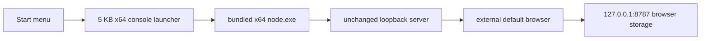

# Microsoft Store package proof

This document owns the current Windows MSIX packaging and Microsoft Store delivery status for
Recap Page. It describes a local x64 proof, not a published Store release.

## Current status

The repository builds two signed x64 MSIX proof packages for an update journey. A signed install on
Windows 11 ARM64 under x64 emulation has proved all of these behaviors:

- Start activation launches the x64 package entry point.
- The package starts its bundled x64 Node runtime and the unchanged local server.
- The server binds and opens exactly <http://127.0.0.1:8787/>.
- Existing reading state remains visible in the same Edge Personal profile.
- A read marker survives package stop and an installed package generation change.
- An occupied port leaves the existing safe guidance visible and opens no alternate origin.
- The original browser state can be restored with every field equal; only the backup export
  timestamp changes between exports.

One explicitly approved UAC prompt temporarily added only the expected public certificate to
LocalMachine TrustedPeople. Versions `2.0.0.0` and `2.0.0.1` installed and the three bounded package
scenarios passed. The package, listeners, launcher processes, private backups, and that exact
thumbprint were removed afterwards; the TrustedPeople store returned to its baseline digest.

The installed scenarios recorded:

- `start-profile-reader-relaunch`: production AUMID activation started the 5,632-byte launcher and
  its x64 Node child, served `proof-2.0.0.0`, displayed the exact ready guidance, and opened the
  current Edge Personal profile with its 1-of-1 read sentinel.
- `busy-port-refusal`: the package Node child exited, the launcher retained the complete existing
  safe guidance, and the browser-window digest did not change.
- `update-state-continuity`: the installed generation changed from `proof-2.0.0.0` to
  `proof-2.0.0.1` at the same origin while the same-profile sentinel remained 1 of 1 read.

The browser backup was restored afterwards. Excluding the regenerated `exportedAt` timestamp, the
pre-proof and restored JSON both had SHA-256
`723fb65b670b9eff25253b4c82e472272465e07d5983e499dccbc03a27135343`.

The TrustedPeople baseline contained one certificate with digest
`6BA56A5FAA86B42F5D081EFC34FCA3D22748B3C57AB0912D90D6784BD029B3FD`.
During the proof it contained that baseline plus only thumbprint
`50B43BE6C1ED610A7E86E7786E589A0AB5581494`. After cleanup the count and digest matched the baseline.

Before owner authorization, importing the same public CER to CurrentUser TrustedPeople succeeded,
but `Add-AppxPackage` failed with `0x800B0109` / `CERT_E_UNTRUSTEDROOT`. That experiment was cleaned
up and was not repeated. It establishes that non-admin trust is insufficient for this full package.

The scoped x64 packaging foundation is complete. The earlier loose registration remains useful
architecture evidence but is not counted as installation evidence.

The package has not passed the Windows App Certification Kit or Partner Center validation. There is
no ARM64 package or bundle. Nothing has been associated, uploaded, submitted, or published.

## Production identity

The owner supplied these non-secret values after reserving **Recap Page** on 2026-08-28:

| Manifest field | Exact value |
|---|---|
| Package Identity Name | `PanelStackLabs.RecapPage` |
| Package Identity Publisher | `CN=F6D9045B-46F0-4EAC-9524-4BFC8A75A472` |
| Publisher display name | `PanelStack Labs` |
| Package family name | `PanelStackLabs.RecapPage_we33aa8nvkpcc` |

The maintained manifest uses those values exactly. Do not derive, shorten, or replace them.

Partner Center did not show a reservation expiration date. Treat 2026-11-28 only as a conservative
planning boundary derived from the reservation date, not as a portal-confirmed expiration.

## Activation architecture



The launcher is compiled from the maintained C# source by the .NET Framework compiler included with
Windows. The package floor is Windows 10 version 2004, which includes .NET Framework 4.8. Current
Windows 11 versions include .NET Framework 4.8.1. The launcher adds no downloaded runtime.

The launcher validates the packaged runtime and server, starts Node with the package root as its
working directory, inherits the visible console, waits for Node to exit, and keeps the output
visible until a key is pressed. It does not bind a port, open the browser, read browser storage, or
write package files.

Three activation routes were measured or evaluated:

- **Direct manifest parameters** launched the correct Node command and opened the correct browser
  origin. A normal run had a visible console, but a busy-port failure exited Node and closed the
  console before its guidance could be read.
- **Package Support Framework** preserved the existing command wrapper and guidance. It was rejected
  because Microsoft states that the official NuGet binaries can send usage telemetry when Windows
  diagnostic collection is enabled. That conflicts with this app's no-telemetry promise.
- **The selected console shim** preserves guidance without PSF, a downloaded SDK, or another runtime.
  A native C++ shim was not built because the proof machine has no supported C++ toolchain.

The manifest declares only `runFullTrust`. It is needed because the package starts a classic desktop
process at medium integrity. Partner Center must review and approve that restricted capability.

## Build the local proof

Prerequisites:

- Windows 10 version 2004 or later
- Node.js 20 or later for repository tooling
- winapp CLI 0.6.0
- Windows Developer Mode for loose registration
- Administrator consent to trust the local proof certificate for `.msix` installation

Build both x64 package versions:

```text
npm run msix:pack
```

The build:

1. Fetches the same pinned official x64 Node runtime as the ZIP packer.
2. Verifies the runtime against Node's published SHA-256 list.
3. Compiles the 5 KB x64 console launcher with the Windows inbox .NET Framework compiler.
4. Generates MSIX image assets from the maintained app icon.
5. Stages versions `2.0.0.0` and `2.0.0.1` with distinct generation markers.
6. Generates one random-password development certificate from the manifest.
7. Signs both packages with that certificate.
8. Deletes the private PFX and password, leaving only the public CER for local trust.

The package layouts, runtime download, generated assets, and launcher binary are staged under the
system temporary directory and removed after packaging. Only the two packages and public CER remain
under ignored `dist/msix/`. Do not commit packages, certificates, logs, or proof reports.

## Complete the installed proof

Open an elevated terminal and trust only the public proof certificate in TrustedPeople:

```text
Import-Certificate -FilePath .\dist\msix\RecapPage-local-proof.cer -CertStoreLocation Cert:\LocalMachine\TrustedPeople
```

Then return to a normal terminal:

```text
npm run msix:prove -- --scenario=start-profile-reader-relaunch
npm run msix:prove -- --scenario=busy-port-refusal
npm run msix:prove -- --scenario=update-state-continuity
```

Each scenario owns its package installation and refuses to run when that package identity is already
registered. It removes only the exact package full name it installed.

The same-profile journey must back up existing state before adding its non-sensitive sentinel and
must restore that backup afterwards. Proof output records only digests, byte lengths, process IDs,
the sentinel, and package generations. It must not record lists, notes, or raw storage.

After the proof, remove the exact package:

```text
Get-AppxPackage -Name PanelStackLabs.RecapPage | Remove-AppxPackage
```

Remove the temporary trusted certificate in an elevated terminal, using the exact thumbprint from the CER:

```text
$thumbprint = (Get-PfxCertificate .\dist\msix\RecapPage-local-proof.cer).Thumbprint
Remove-Item "Cert:\LocalMachine\TrustedPeople\$thumbprint"
```

Confirm port 8787 is free and no `PanelStackLabs.RecapPage` package remains before deleting
`dist/msix/`.

## Browser storage and uninstall behavior

Package files are read-only. The launcher and server write nothing into the install directory.
Lists, notes, settings, overrides, read markers, IndexedDB metadata, and browser caches remain owned
by the external browser at the exact origin and profile.

Stopping, updating, uninstalling, or reinstalling the package does not remove that browser-owned
state. Clearing site data for `127.0.0.1:8787`, using another browser profile, changing the hostname,
or changing the port selects or destroys a different browser storage bucket.

The GitHub ZIP remains the public Windows download. The MSIX does not replace it until Store
certification passes and the owner explicitly changes release policy.

## Remaining Store gates

- Approve the `runFullTrust` explanation in Partner Center.
- Build and measure an ARM64 launcher and matching official ARM64 Node runtime.
- Produce and inspect the x64 and ARM64 MSIX bundle.
- Run the Windows App Certification Kit.
- Use the dedicated [privacy policy](../PRIVACY.md) URL and review every listing disclosure.
- Complete Partner Center package validation.
- Review markets, age rating, listing copy, screenshots, legal terms, and certification notes.
- Upload and submit only after explicit owner approval.

The owner owns every Partner Center action. Repository automation never requests credentials,
accepts terms, reserves a name, uploads a package, or submits a listing.

## Official references

- [Application activation fields and packaged classic apps](https://learn.microsoft.com/uwp/schemas/appxpackage/uapmanifestschema/element-application)
- [App capability declarations](https://learn.microsoft.com/windows/apps/package-and-deploy/app-capability-declarations)
- [MSIX app package requirements](https://learn.microsoft.com/windows/apps/publish/publish-your-app/msix/app-package-requirements)
- [Package Support Framework](https://learn.microsoft.com/windows/msix/psf/package-support-framework)
- [.NET Framework on Windows](https://learn.microsoft.com/dotnet/framework/install/on-windows-and-server)
