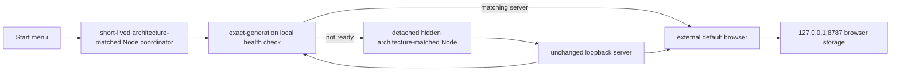

# Microsoft Store package and certification proof

This document owns the current Windows MSIX packaging and Microsoft Store delivery status for
Recap Page. It describes local package evidence, not a published Store release.

## Current status

The first x64/ARM64 version `2.0.0.0` bundle was submitted on 2026-08-29 and failed certification
under technical requirement 10.1.2.10 Functionality. The tester could launch the browser shell, but
Browse, Find a creator, Find a series, and Add to library later encountered `Failed to fetch`.
Reproduction showed that the service worker could keep the shell visible after the package's local
server stopped.

The rejected package tied its server child to a visible console. Closing that console terminates
both attached Node processes while leaving already cached browser resources available. The corrected
launcher instead starts a hidden detached server, verifies the exact package generation through an
uncacheable local health response, opens the browser only after readiness, and then exits. A later
local-data failure checks that health response and gives direct reconnection guidance.

The repository now builds signed x64 and ARM64 version `2.0.1.0` proof packages, one x64/ARM64
bundle, and an isolated x64 `2.0.1.1` update package. The release integration uses the frozen
certification-fix baseline. Store submission and publication remain separate owner-controlled
steps.

The earlier 2.0.0 structural inspection on Windows 11 ARM64 proved:

- Both package manifests use the exact production identity and Store-safe version `2.0.0.0`.
- The bundle contains exactly one x64 package and one ARM64 package at that version.
- Each package contains one executable payload: its architecture-matched official Node runtime.
- The packaged runtime executable reported x64 for the x64 package and ARM64 for the ARM64 package.
- The packaged x64 and ARM64 Node executables match Node's published SHA-256 values.
- The proof-only x64 version `2.0.0.1` is outside `dist/msix/` and absent from the bundle.

The exact submitted artifact hashes are:

| Artifact | SHA-256 |
|---|---|
| x64 MSIX | `BF0F1C87E4EE30821C87F80F08A670D0954B2D6CE06CF92542E2359F17AFCEAE` |
| ARM64 MSIX | `352CC645DD294C29425E0B8428F8A873B17295BF4BBEF37383226AA80CA57E58` |
| x64/ARM64 bundle | `EB5A6655882B261F87255F3A5D438B69A0233E55996B67F48410FE0200A52C1B` |

The submitted bundle contained 544 files in each architecture slice. Every packaged `src/` file and
the server matched source commit `3e6c578c6bac2e913c53f2730364fe6ba4306fb3`; both creator and
series indexes, the catalog, and a representative Reading List were present and valid JSON. Its
signer thumbprint was `11BBD6369437CBB8682279C167CF802D0FD41116`; it is not trusted in any
checked CurrentUser or LocalMachine certificate store.

The earlier corrected artifacts, before Store submission, passed four aimed installed scenarios:

- The x64 package started at the canonical origin with complete ready guidance.
- The x64 package refused an occupied port with complete safe guidance, no browser-window change,
  and a witnessed server-child exit.
- Installing the final bundle on Windows 11 ARM64 selected its ARM64 slice and started at the
  canonical origin with complete ready guidance.
- The ARM64 slice refused an occupied port with complete safe guidance, no browser-window change,
  and a witnessed server-child exit.

The earlier candidate was installed with only certificate thumbprint
`E36EBC5FA20DA01A8D73E30B7C6EB25FAFAD188E` temporarily trusted in LocalMachine
TrustedPeople. All five installed scenarios passed:

- The x64 package started at the production AUMID, served `proof-2.0.0.0` at the canonical origin,
  and retained both ready-guidance lines.
- The x64 package refused an occupied port, retained all safe guidance, exited its server child, and
  left the browser-window digest unchanged.
- The x64 proof-only update changed the served generation from `proof-2.0.0.0` to
  `proof-2.0.0.1`.
- Installing the final bundle on Windows 11 ARM64 selected its ARM64 slice, started native ARM64
  supervisor and server processes, served `proof-2.0.0.0`, and retained ready guidance.
- The ARM64 slice selected from the final bundle refused an occupied port, retained every safe
  guidance line, exited its server child, and left the browser-window digest unchanged.

The earlier update journey did not repeat because package version flow and browser behavior did not
change. It remains evidence for version selection and state continuity rather than for the corrected
launcher bytes.

After each installed proof, the exact certificate was removed. CurrentUser Root and LocalMachine
Root returned to 49 certificates with digest
`CBEABFC3A4AED45E67ECB54F4FE73E74CEE39F4C95A9849C883CCDA6C9A6543D`.
CurrentUser TrustedPeople and LocalMachine TrustedPeople returned to one certificate with digest
`6BA56A5FAA86B42F5D081EFC34FCA3D22748B3C57AB0912D90D6784BD029B3FD`.
Neither the current nor earlier proof thumbprint remains in those stores.

The earlier signed x64 package installed on Windows 11 ARM64 under x64 emulation and proved:

- Start activation launched the earlier x64 package entry point.
- The package starts its bundled x64 Node runtime and the unchanged local server.
- The server binds and opens exactly <http://127.0.0.1:8787/>.
- Existing reading state remains visible in the same Edge Personal profile.
- A read marker survives package stop and an installed package generation change.
- An occupied port leaves the existing safe guidance visible and opens no alternate origin.
- The original browser state can be restored with every field equal; only the backup export
  timestamp changes between exports.

One explicitly approved UAC prompt for that earlier proof temporarily added only its public certificate to
LocalMachine TrustedPeople. Versions `2.0.0.0` and `2.0.0.1` installed and the three bounded package
scenarios passed. The package, listeners, launcher processes, private backups, and that exact
thumbprint were removed afterwards; the TrustedPeople store returned to its baseline digest.

Those installed scenarios recorded:

- `start-profile-reader-relaunch`: production AUMID activation started the 5,632-byte launcher and
  its x64 Node child, served `proof-2.0.0.0`, displayed the exact ready guidance, and opened the
  current Edge Personal profile with its 1-of-1 read sentinel.
- `busy-port-refusal`: the package Node child exited, the launcher retained the complete existing
  safe guidance, and the browser-window digest did not change.
- `update-state-continuity`: the installed generation changed from `proof-2.0.0.0` to
  `proof-2.0.0.1` at the same origin while the same-profile sentinel remained 1 of 1 read.

The browser backup was restored afterwards. Excluding the regenerated `exportedAt` timestamp, the
pre-proof and restored JSON both had SHA-256
`723fb65b670b9eff25253b4c82e472272465e07d5983e499dccbc03a27135343`.

The TrustedPeople baseline contained one certificate with digest
`6BA56A5FAA86B42F5D081EFC34FCA3D22748B3C57AB0912D90D6784BD029B3FD`.
During the proof it contained that baseline plus only thumbprint
`50B43BE6C1ED610A7E86E7786E589A0AB5581494`. After cleanup the count and digest matched the baseline.

Before owner authorization, importing the same public CER to CurrentUser TrustedPeople succeeded,
but `Add-AppxPackage` failed with `0x800B0109` / `CERT_E_UNTRUSTEDROOT`. That experiment was cleaned
up and was not repeated. It establishes that non-admin trust is insufficient for this full package.

The earlier loose registration remains useful architecture evidence but is not counted as
installation evidence.

Windows App Certification Kit completed on a supported x64 Windows Server 2022 command-line host
using an elevated process in an active session and a validly Microsoft-signed WACK.

The x64 package and x64/ARM64 bundle each completed 24 test categories: 22 passed, `Blocked
executables` produced the documented optional Desktop Bridge failure, and `DPIAwarenessValidation`
produced a warning. WACK therefore reported `WARNING` with `PARTIAL_RUN=FALSE` for both inputs. The
blocked executable is the architecture-matched official Node runtime, the package's only executable
payload, and Microsoft says that optional result may be ignored when the executable is part of the
app. The DPI warning applies to that console runtime; the app's visual surface remains the external
browser. Neither result warrants altering the published Node binary or its verified hash.

A source-continuity gate proves that every package-copied input remains identical to the merged
corrected build. Random hosted signing changes the workflow's proof hashes on every run, so those
run-specific values belong in the delivery pull request rather than this maintained document. The
hashes above identify only the rejected 2.0.0 submission and must not be reused for its replacement.

The workflow uploaded no package, certificate, installer, log, or report artifact. Its public output
contains only allowlisted host facts, hashes, test names, and result categories. Raw WACK output and
reports, the randomly generated package inputs, exact package registration, and temporary
certificate trust were removed. Nothing has been associated, uploaded, submitted, or published.

## Production identity

The owner supplied these non-secret values after reserving **Recap Page** on 2026-08-28:

| Manifest field | Exact value |
|---|---|
| Package Identity Name | `PanelStackLabs.RecapPage` |
| Package Identity Publisher | `CN=F6D9045B-46F0-4EAC-9524-4BFC8A75A472` |
| Publisher display name | `PanelStack Labs` |
| Package family name | `PanelStackLabs.RecapPage_we33aa8nvkpcc` |

The maintained manifest uses those values exactly. Do not derive, shorten, or replace them.

Partner Center did not show a reservation expiration date. Treat 2026-11-28 only as a conservative
planning boundary derived from the reservation date, not as a portal-confirmed expiration.

## Activation architecture



The Windows inbox .NET Framework compiler cannot target ARM64. An AnyCPU executable also runs under
x64 emulation on Windows on Arm unless it uses a Windows 11 24H2-only application-manifest setting.
That choice would either leave older package targets emulated or raise the Windows floor for both
bundle slices. A second native toolchain or launcher runtime would add another supply-chain surface.

The selected launcher therefore uses the official Node executable already required by each package.
The maintained JavaScript coordinator validates the packaged server and generation, starts it with
the package root as its working directory, removes every casing of `MRT_PORT` and `MRT_NO_OPEN`, and
gives the server independent hidden process and stream ownership. It waits for the exact-generation
health response before opening the browser, then exits. Another activation reuses only that matching
server. It does not bind a port, read browser storage, write package files, or make an external
network request.

Three activation routes were measured or evaluated:

- **Direct manifest parameters** launched the correct Node command and opened the correct browser
  origin. A normal run had a visible console, but a busy-port failure exited Node and closed the
  console before its guidance could be read.
- **Package Support Framework** preserved the existing command wrapper and guidance. It was rejected
  because Microsoft states that the official NuGet binaries can send usage telemetry when Windows
  diagnostic collection is enabled. That conflicts with this app's no-telemetry promise.
- **The selected Node coordinator** keeps startup failure guidance without PSF, a downloaded launcher
  runtime, or an emulated entry process. Successful launch leaves no console to close. The x64 and
  ARM64 package entry executables are the official native Node binaries already needed by the
  server.

The manifest declares only `runFullTrust`. It is needed because the package starts a classic desktop
process at medium integrity. Partner Center must review and approve that restricted capability.

## Build the local proof

Prerequisites:

- Windows 10 version 2004 or later
- Node.js 20 or later for repository tooling
- winapp CLI 0.6.0
- Windows Developer Mode for loose registration
- Administrator consent to trust the local proof certificate for `.msix` installation
- `puppeteer-core` installed outside the repository, with `MRT_PUPPETEER` pointing to its entry file

Build the x64 and ARM64 Store packages, their bundle, and the isolated x64 update-proof package:

```text
npm run msix:pack
```

The build:

1. Fetches pinned official x64 and ARM64 Node runtimes.
2. Verifies both archives against Node's published SHA-256 list.
3. Stages native x64 and ARM64 version `2.0.1.0` package layouts.
4. Stages x64 version `2.0.1.1` under a separate proof-only output boundary.
5. Generates MSIX image assets from the maintained app icon.
6. Generates one random-password development certificate from the manifest.
7. Signs both Store packages, the bundle, and the proof-only update with that certificate.
8. Deletes the private PFX and password, leaving only the public CER for local trust.

The package layouts, runtime downloads, generated assets, and launcher inputs are staged under the
system temporary directory and removed after packaging. Only Store-safe version `2.0.1.0` artifacts
and the public CER remain under ignored `dist/msix/`; version `2.0.1.1` remains under ignored
`dist/msix-proof/`. Do not commit packages, certificates, logs, or proof reports.

Inspect the two packages, both bundle slices, PE machine fields, official Node executable hashes,
and live process architectures without installing anything:

```text
npm run msix:inspect
```

## Complete the installed proof

Open an elevated terminal and trust only the public proof certificate in TrustedPeople:

```text
Import-Certificate -FilePath .\dist\msix\RecapPage-local-proof.cer -CertStoreLocation Cert:\LocalMachine\TrustedPeople
```

Then return to a normal terminal:

```text
npm run msix:prove -- --scenario=certification-functionality
npm run msix:prove -- --scenario=busy-port-refusal
npm run msix:prove -- --scenario=update-state-continuity
npm run msix:prove -- --architecture=arm64 --source=bundle --scenario=certification-functionality
npm run msix:prove -- --architecture=arm64 --source=bundle --scenario=busy-port-refusal
```

On PowerShell, point the installed browser journey at the same external scratch driver used by the
ordinary browser suite:

```text
$env:MRT_PUPPETEER='C:\path\to\scratch\node_modules\puppeteer-core\lib\puppeteer\puppeteer-core.js'
```

For the corrected runtime, use `certification-functionality` in place of
`start-profile-reader-relaunch`. That scenario starts the package twice across the pre-ready window,
requires one settled server, fetches and parses the creator index, series index, catalog, and House
of M payload, exercises Browse and both name searches in Edge, distinguishes an external metadata
failure, removes uncached local payloads, stops the server, verifies direct recovery guidance, and
relaunches it. It then removes the package while the server is live and requires Windows to end the
exact process and release port 8787 before fallback cleanup.

Each scenario owns its package installation and refuses to run when that package identity is already
registered. The functionality scenario first asks Windows to remove the package while its background
server is live and requires the exact process, listener, and registration to disappear. Recovery
cleanup runs only after that product assertion and reports the failure rather than turning it into a
pass. Process enumeration, exact-PID stopping, package removal, and scenario-specific cleanup are
attempted independently so one cleanup failure cannot skip another.

Browser-backed scenarios use an isolated temporary Edge profile and a fixed non-sensitive sentinel.
The profile is removed after the run. Proof output records only digests, byte lengths, process IDs,
the sentinel result, and package generations. It must not record real lists, notes, or raw storage.

The runner automates package installation, Start activation, coordinator exit, background process
ownership, exact-generation health, the exact origin, essential local data, browser functionality,
busy-port refusal, package generation changes, and live removal. The busy-port scenario copies only
the exact installed runtime, coordinator, server entry, and generation marker to a temporary layout,
executes those bytes, captures their output, and removes the layout. This avoids depending on either
the Windows console host or direct execution permission in the protected Server 2022 package
directory. A temporary Edge profile verifies browser-owned state continuity during the x64 update
proof. Synchronous reader-tab behavior remains owned by the ordinary browser suite because the
installed proof does not contact Marvel.

The update scenario is x64-only because its `2.0.1.1` package is local proof material. The ARM64
package and final bundle contain only Store-safe version `2.0.1.0`.

The runner recursively prints every nested `AggregateError`. A failure that combines scenario and
cleanup errors preserves each cause before any decision to repeat it. Busy-port refusal captures the
installed coordinator's guidance and requires that no package server child was created. Missing
ownership metadata is unknown and cannot report success.

## Run Windows App Certification Kit

WACK is deprecated and no longer maintained, but Microsoft still recommends it as an optional local
pre-submission check. Partner Center performs the official certification after submission.

The durable workflow uses the standard `windows-2022` x64 runner. Microsoft lists Windows Server 2022
as a supported command-line Windows SDK host; the no-cost Server 2025 runner is deliberately not
used because the current SDK requirements do not list it. The workflow also refuses Session0, a
non-administrator token, a non-AMD64 process, an absent kit, and an `appcert.exe` without a valid
Microsoft signature.

The workflow runs when package behavior, package proof, or its own WACK automation changes in a pull
request, and it is also available by manual dispatch. Its installed jobs use architecture-native
x64 and Windows on Arm hosts for the certification journey. The WACK job remains on the supported
Windows Server 2022 x64 command-line host. Every job uses a read-only repository token, pinned
actions, telemetry opt-out, and no secrets or artifact upload.

Each run rebuilds randomly signed proof inputs without changing the maintained package sources. It
then temporarily trusts only that run's certificate and applies Microsoft's command-line sequence:
`appcert.exe reset`, followed by `appcert.exe test -appxpackagepath ... -reportoutputpath ...`, once
for the x64 package and once for the final bundle. The x64 run covers the x64 entry payload; the
bundle run covers the submitted container and both package manifests. ARM64 runtime behavior remains
owned by the installed Windows on Arm proof above.

Only `Blocked executables=FAIL` and `DPIAwarenessValidation=WARNING` are accepted as known optional
results. Any other non-pass category, explicit partial run, explicit outdated-kit marker, malformed
report, command failure, or cleanup residue fails the workflow. The parser disables DTD and external
resolution, caps the report at 16 MiB, emits no descriptions or paths, and deletes raw XML, HTML,
stdout, and stderr after extracting allowlisted fields.

Cleanup independently removes the exact `PanelStackLabs.RecapPage` registration, the run's exact
certificate thumbprint, all WACK reports, and every generated package. A second always-run workflow
step repeats those boundaries if the main runner is interrupted.

## Browser storage and uninstall behavior

Package files are read-only. The launcher and server write nothing into the install directory.
Lists, notes, settings, overrides, read markers, IndexedDB metadata, and browser caches remain owned
by the external browser at the exact origin and profile.

Stopping, updating, uninstalling, or reinstalling the package does not remove that browser-owned
state. Clearing site data for `127.0.0.1:8787`, using another browser profile, changing the hostname,
or changing the port selects or destroys a different browser storage bucket.

The GitHub ZIP remains the public Windows download. The MSIX does not replace it until Store
certification passes and the owner explicitly changes release policy.

## Remaining Store gates

- Review the maintained [submission packet](MICROSOFT_STORE_SUBMISSION.md), its sanitized assets,
  and every owner-only stop point.
- Approve the `runFullTrust` explanation in Partner Center.
- Use the dedicated [privacy policy](../PRIVACY.md) URL and review every listing disclosure.
- Complete Partner Center package validation.
- Review markets, age rating, listing copy, screenshots, legal terms, and certification notes.
- Upload and submit only after explicit owner approval.

The owner owns every Partner Center action. Repository automation never requests credentials,
accepts terms, reserves a name, uploads a package, or submits a listing.

## Official references

- [Application activation fields and packaged classic apps](https://learn.microsoft.com/uwp/schemas/appxpackage/uapmanifestschema/element-application)
- [App capability declarations](https://learn.microsoft.com/windows/apps/package-and-deploy/app-capability-declarations)
- [MSIX app package requirements](https://learn.microsoft.com/windows/apps/publish/publish-your-app/msix/app-package-requirements)
- [Package Support Framework](https://learn.microsoft.com/windows/msix/psf/package-support-framework)
- [Add Arm support to a Windows app](https://learn.microsoft.com/windows/arm/add-arm-support)
- [MSIX package and bundle requirements](https://learn.microsoft.com/windows/apps/publish/publish-your-app/msix/app-package-requirements)
- [Windows App Certification Kit](https://learn.microsoft.com/windows/uwp/debug-test-perf/windows-app-certification-kit)
- [Windows Desktop Bridge WACK tests](https://learn.microsoft.com/windows/uwp/debug-test-perf/windows-desktop-bridge-app-tests)
- [Windows SDK supported hosts](https://learn.microsoft.com/windows/apps/windows-sdk/)
- [GitHub-hosted runner architecture and cost](https://docs.github.com/actions/reference/runners/github-hosted-runners)
- [GitHub token permissions](https://docs.github.com/actions/tutorials/authenticate-with-github_token)
- [winapp CLI multi-architecture bundles](https://learn.microsoft.com/windows/apps/dev-tools/winapp-cli/usage#multi-architecture-bundles)
- [Node v24.19.0 published checksums](https://nodejs.org/dist/v24.19.0/SHASUMS256.txt)
